# Výběr semináře

Tento dokument popisuje funkční chování systému **Zápis seminářů**.  
Cílem je umožnit studentům přihlásit se na nabízené semináře (předměty) v rámci definovaného zápisu, který spravuje administrátor.

## Motivace

Tento systém vznikl jako jednoduchý, přehledný a interaktivní nástroj pro **organizaci školních seminářů a zápisů studentů**.  
Je navržen tak, aby pokryl všechny klíčové potřeby konkrétná školy kde se planuje systém nasadit, ale zároveň zůstal dostatečně lehký, intuitivní a snadno upravitelný.

### hlavní cíle

Cílem systému je vytvořit **jednotné místo**, kde:

- studenti mohou snadno **vybírat semináře** podle svých preferencí  
- učitelé mají přehled o svých skupinách a mohou vidět zapsané studenty  
- administrátoři mohou **spravovat předměty, bloky, zápisová období a uživatele**  
- celý proces zápisu je jasně strukturovaný, přehledný a transparentní

Systém tak eliminuje ruční evidenci, zdlouhavou komunikaci e-mailem nebo tabulkovými procesory a přináší **automatizaci a pořádek**.

## SEO a klíčová slova

SEO má význam především u veřejně dostupných webů, které se mají zobrazovat ve výsledcích vyhledávání a kde je to naše snaha. Tento systém je ale čistě interní – přístup mají pouze přihlášení uživatelé (studenti, učitelé, administrátoři).

Teoreticky by SEO dávalo smysl v případě, že bychom chtěli aby ji byly studenti schopni najít ve vyhledávači, namísto odkazu na stránkach školy. To však není cílem tohoto interního systému.

## Přihlášení a role

1. Po otevření aplikace se uživatel musí **přihlásit nebo registrovat**.  
   Nepřihlášený uživatel vidí pouze veřejnou úvodní stránku s tlačítky *Přihlásit se* a *Vytvořit účet*.
2. Po registraci má uživatel vždy výchozí roli **GUEST**.
3. **Admin** spravuje seznam uživatelů, jejich aktivaci a přiřazování rolí (`Role` = GUEST, STUDENT, TEACHER, ADMIN).
4. Uživatel může být aktivní nebo zablokovaný (`isActive`).
5. Každá role má definovaný přístup pouze ke své části systému.

### Popis rolí

#### Guest (`GUEST`)

- Výchozí role po registraci.
- Navigace pro GUEST zobrazuje pouze **přehled zápisů**.
- GUEST se nemůže zapisovat ani upravovat data.

#### Student (`STUDENT`)

- Vidí **dashboard** s dostupnými zápisovými obdobími (`EnrollmentWindow`).
- Pokud má zápis stav **OPEN**, může:
  - **zapsat se** na výskyt předmětu (`SubjectOccurrence`),
  - **odhlásit se** ze svého zápisu.
- Omezení implementovaná v UI:
  - v rámci jednoho **bloku** (`Block`) může mít student **nejvýše jeden aktivní zápis**,  
  - pokud je stejný předmět (`Subject`) nabízen ve více blocích, může být zapsán pouze do jednoho z nich.
- Vidí obsazenost výskytů (např. `7/30`).
- Může zobrazit detail předmětu a jeho syllabus.

#### Teacher (`TEACHER`)

- Má přístup k sekcím **Předměty** a **Uživatelé** (v režimu jen pro čtení).
- Může vytvářet a upravovat **předměty** (`Subject`).
- Vidí zápisy (`EnrollmentWindow`) a jejich bloky, ale **nemůže se zapisovat**.
- Vidí obsazenost výskytů (např. `7/30`) a může otevřít dialog se seznamem zapsaných studentů.
- Na stránce `/users` vidí seznam uživatelů, ale **nemůže měnit role, stav účtů ani resetovat hesla**.

#### Admin (`ADMIN`)

- Vidí v navigaci všechny sekce aplikace:
  - **Dashboard**
  - **Zápisy**
  - **Předměty**
  - **Uživatelé**
  - **Nastavení** (základní informace)
- Může spravovat role a aktivaci uživatelů.
- Může vytvářet, upravovat **předměty**, **bloky**, **výskyty** i **zápisy**.
- Může **spouštět a ukončovat zápisy** (mění `Status` na OPEN nebo CLOSED).
- Může **zapisovat studenty ručně**, nebo je ze zápisu odstranit.
- Může dělat **exporty dat** ze všech seznamů.
- Má přístup k auditním údajům (`createdById`, `updatedById`, `deletedById`).

---

## Entity a datové typy

### Datové typy

#### Uživatel (`User`)

Reprezentuje uživatele systému (student, učitel, admin nebo guest).

| Název | Typ | Popis |
|-------|-----|-------|
| `id` | `string` | Jedinečný identifikátor uživatele |
| `firstName` | `string` | Křestní jméno |
| `lastName` | `string` | Příjmení |
| `email` | `string` | E-mailová adresa (musí být školní) |
| `passwordHash` | `string \| null` | Hash hesla (může být `null`, pokud používá SSO nebo nebylo nastaveno) |
| `role` | `Role` | Role uživatele |
| `isActive` | `boolean` | Indikuje, zda je účet aktivní |
| `lastLoginAt` | `Date?` | Datum posledního přihlášení |
| `createdAt` | `Date` | Datum vytvoření záznamu |
| `updatedAt` | `Date` | Datum poslední aktualizace |

| Role | Popis |
|----------|--------|
| `GUEST`   | nově registrovaný uživatel čekající na schválení |
| `STUDENT` | student, který se zapisuje na předměty |
| `TEACHER` | vyučující, který spravuje předměty a vidí své studenty |
| `ADMIN`   | správce systému s plnými oprávněními |

#### Zápis (`EnrollmentWindow`)

- Zápis představuje **časové období**, během kterého mohou studenti vybírat předměty.  
- Každý zápis obsahuje:
  - název, popis a stav (`Status`),
  - časové rozmezí (`startsAt` → `endsAt`),
  - viditelnost pro studenty (`visibleToStudents`),
  - seznam bloků (`Block`).

| Název | Typ | Popis |
|-------|-----|-------|
| `id` | `string` | Jedinečný identifikátor zápisu |
| `name` | `string` | Název zápisu (např. „Zápis LS 2025“) |
| `description` | `string?` | Volitelný popis nebo poznámka |
| `status` | `Status` | Stav zápisu (DRAFT, SCHEDULED, OPEN, CLOSED) |
| `startsAt` | `Date` | Datum a čas začátku zápisu |
| `endsAt` | `Date` | Datum a čas ukončení zápisu |
| `visibleToStudents` | `boolean` | Určuje, zda zápis vidí studenti |
| `createdById` | `string` | ID uživatele, který zápis vytvořil |
| `updatedById` | `string?` | ID uživatele, který zápis naposledy upravil |
| `createdAt` | `Date` | Datum vytvoření záznamu |
| `updatedAt` | `Date` | Datum poslední aktualizace |

| Status | Popis |
|----------|--------|
| `DRAFT`      | návrh zápisu, zatím neaktivní |
| `SCHEDULED`  | naplánovaný zápis, čeká na začátek |
| `OPEN`       | zápis je aktivní, studenti se mohou zapisovat |
| `CLOSED`     | zápis je uzavřený, pouze k nahlédnutí |

> **Automatická synchronizace stavu:** Systém při každém načtení zápisového okna porovná nastavený stav s aktuálním serverovým časem. Pokud je stav `SCHEDULED` ale aktuální čas je po `startsAt`, systém automaticky přepne stav na `OPEN`. Analogicky, pokud je stav `OPEN` ale čas je po `endsAt`, systém přepne na `CLOSED`. Stav `DRAFT` se nikdy nepřepíná automaticky – vyžaduje manuální změnu administrátorem.

#### Bloky (`Block`)

- Blok představuje **logickou skupinu výskytů předmětů** v rámci jednoho zápisu.  
  Například: *Blok 1 – povinné*, *Blok 2 – volitelné*.
- Každý blok:
  - patří právě jednomu zápisu (`enrollmentWindowId`),
  - má pořadí (`order`), které určuje jeho pozici ve výpisu,
  - může mít popis (`description`),
  - může být smazán (soft delete).
- Student se musí zapsat **právě na jeden výskyt** (`SubjectOccurrence`) v každém bloku.
- Bloky jsou zobrazovány studentům podle pořadí.

| Název | Typ | Popis |
|-------|-----|-------|
| `id` | `string` | Jedinečný identifikátor bloku |
| `name` | `string` | Název bloku (např. „Blok 1 – povinné“) |
| `order` | `number` | Pořadí bloku ve výpisu |
| `description` | `string?` | Volitelný popis |
| `enrollmentWindowId` | `string` | ID zápisu, do kterého blok patří |
| `createdById` | `string` | ID uživatele, který blok vytvořil |
| `updatedById` | `string?` | ID uživatele, který blok naposledy upravil |
| `createdAt` | `Date` | Datum vytvoření záznamu |
| `updatedAt` | `Date` | Datum poslední aktualizace |
| `deletedAt` | `Date?` | Datum smazání (soft delete) |
| `deletedById` | `string?` | ID uživatele, který blok smazal |

#### Předměty (`Subject`) a výskyty (`SubjectOccurrence`)

##### Předmět (`Subject`)

je obecná definice kurzu — obsahuje název, sylabus a autora.

| Název | Typ | Popis |
|-------|-----|-------|
| `id` | `string` | Jedinečný identifikátor předmětu |
| `name` | `string` | Název předmětu |
| `code` | `string?` | Volitelný kód předmětu (např. INF101) |
| `syllabus` | `string` | Popis obsahu a cílů předmětu |
| `createdById` | `string` | ID uživatele, který předmět vytvořil |
| `updatedById` | `string?` | ID uživatele, který předmět naposledy upravil |
| `createdAt` | `Date` | Datum vytvoření záznamu |
| `updatedAt` | `Date` | Datum poslední aktualizace |

##### Výskyt (`SubjectOccurrence`)

představuje konkrétní instanci předmětu v určitém bloku:

- Každý výskyt má svého učitele (`teacherId`), kapacitu a kód skupiny (např. „A“, „B“, „C“).
- Pokud je `capacity = null`, zápis je **neomezený**.
- V jednom bloku může být více výskytů stejného předmětu s různými učiteli nebo kódy skupin.
- Admin může výskyty vytvářet, upravovat i mazat během otevřeného zápisu.

| Název | Typ | Popis |
|-------|-----|-------|
| `id` | `string` | Jedinečný identifikátor výskytu |
| `subjectId` | `string` | ID původního předmětu |
| `blockId` | `string` | ID bloku, do kterého výskyt patří |
| `teacherId` | `string` | ID učitele, který výskyt vyučuje |
| `subCode` | `string?` | Kód skupiny (např. „A“, „B“, „C“) |
| `capacity` | `number \| null` | Maximální počet studentů (null = neomezená kapacita) |
| `createdById` | `string` | ID uživatele, který výskyt vytvořil |
| `updatedById` | `string?` | ID uživatele, který výskyt upravil |
| `createdAt` | `Date` | Datum vytvoření |
| `updatedAt` | `Date` | Datum poslední aktualizace |
| `deletedAt` | `Date?` | Datum smazání (soft delete) |
| `deletedById` | `string?` | ID uživatele, který výskyt smazal |

#### Zápis studenta (`StudentEnrollment`)

- Student se zapisuje na konkrétní **výskyt předmětu** (`SubjectOccurrence`).
- Každý zápis obsahuje informaci o tom, kdo ho vytvořil (`createdById`) a kdy (`createdAt`).
- Odhlášení (soft delete) je možné pouze, pokud je zápis (`EnrollmentWindow`) ve stavu **OPEN**.
- Po ukončení zápisu (`Status = CLOSED`) může student pouze prohlížet své zapsané předměty.

| Název | Typ | Popis |
|-------|-----|-------|
| `id` | `string` | Jedinečný identifikátor zápisu |
| `studentId` | `string` | ID studenta (User.id) |
| `subjectOccurrenceId` | `string` | ID výskytu předmětu, na který je zapsán |
| `createdById` | `string` | ID uživatele, který zápis vytvořil |
| `updatedById` | `string?` | ID uživatele, který zápis upravil |
| `createdAt` | `Date` | Datum vytvoření |
| `updatedAt` | `Date` | Datum poslední aktualizace |
| `deletedAt` | `Date?` | Datum smazání (pokud se student odhlásil) |
| `deletedById` | `string?` | ID uživatele, který zápis odstranil |

### Aplikační pravidla

1. Student může mít v rámci jednoho **bloku** pouze **jeden aktivní zápis**.
2. Student se **nemůže zapsat na stejný předmět ve více blocích jednoho zápisu**.
3. Odhlášení nebo přepsání je možné pouze ve stavu `OPEN`.
4. Všechny kontroly při zápisu (kapacita, duplicita, stav okna) probíhají v rámci **serializovatelné databázové transakce**, která zamezuje race conditions.
5. Validace stavu zápisového okna probíhá striktně na základě **serverového času** – klientský čas nemá vliv.

#### Shrnutí vztahů

- `User` 1–N `Subject` (vytvořil)
- `User` 1–N `SubjectOccurrence` (učí)
- `User` 1–N `StudentEnrollment` (studenti se zapisují)
- `EnrollmentWindow` 1–N `Block`
- `Block` 1–N `SubjectOccurrence`
- `Subject` 1–N `SubjectOccurrence`
- `SubjectOccurrence` 1–N `StudentEnrollment`

## Front end

Toto zadání popisuje strukturu a funkčnost front-endové části aplikace postavené na Next.js a shadcn/ui.

---

### 1. Wireframe

#### Welcome (Úvodní obrazovka)

**Účel:**  
Slouží jako vstupní stránka pro nepřihlášeného uživatele. Poskytuje dvě hlavní akce: přihlášení nebo registraci.

**Vizuální struktura:**  

- Centrální karta zarovnaná doprostřed obrazovky.  
- Nadpis *„Login“* (označení sekce).  
- Dvě velká tlačítka:  
  - **Login** – přechod na přihlašovací formulář  
  - **Sign up** – přechod na registrační formulář  
- Rozhraní je minimalistické, aby uživatel okamžitě pochopil, že je třeba se nejprve přihlásit.

**Cílové chování:**  

- Nepřihlášený uživatel nemá přístup k žádným dalším částem systému.  
- Stránka funguje jako rozcestník.

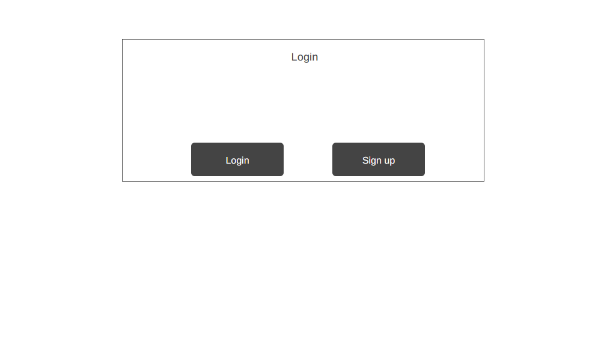

#### Login (Přihlášení uživatele)

**Účel:**  
Umožňuje uživateli zadat e-mail a heslo pro vstup do aplikace.

**Vizuální struktura:**  

- Formulář umístěný ve středu obrazovky.  
- Prvky formuláře:
  - Pole **E-mail**
  - Pole **Password**
  - Tlačítko **Login** (dominantní primární akce)
- Čisté a jednoduché rozložení pro snadný přístup.

**Cílové chování:**  

- Po zadání platných údajů je uživatel přesměrován na dashboard dle své role (STUDENT/TEACHER/ADMIN).  
- Chybné přihlašovací údaje zobrazí upozornění.

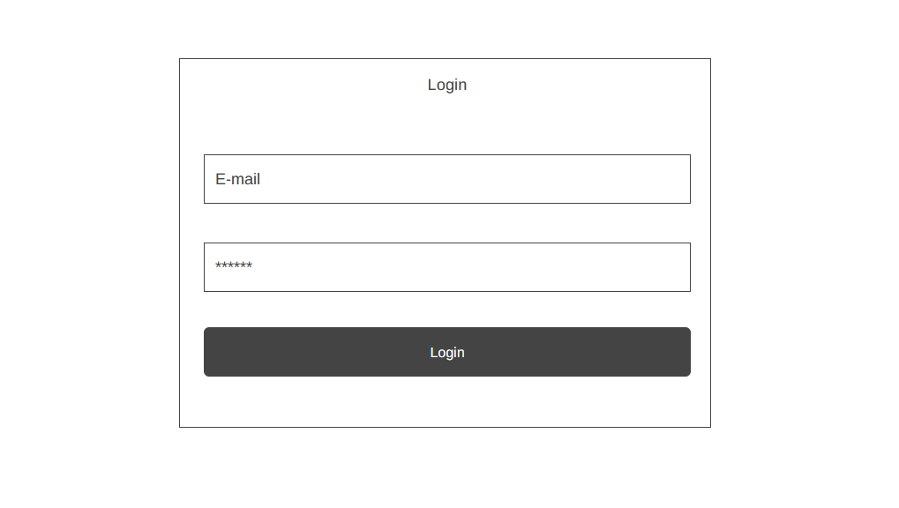

#### Seznam objektů (List view – práce s entitami)

**Účel:**  
Stránka pro správu jednotlivých objektů (předmětů, uživatelů, zápisů) podle typu entity.  
Slouží hlavně administrátorům a učitelům.

**Vizuální struktura:**  

- Horní navigační lišta (Top Bar) se záložkami typu:  
  - *Link one*  
  - *Link two*  
  - *Link three*
  - tlačítko **Log out**
- Název stránky (**Title**) vlevo nahoře.
- Primární akce vpravo nahoře (např. **“This button does something”** – typicky „Nový záznam“, „Export“ apod.).
- Velká tabulková oblast (**Table of content**) zabírá hlavní část stránky:
  - seznam všech položek (např. předmětů)
  - řazení, filtrování, akce nad řádky (editace, mazání)

**Cílové chování:**  

- Seznam je centrálním místem pro operace.  
- Administrátor/učitel zde může snadno spravovat velké množství dat.

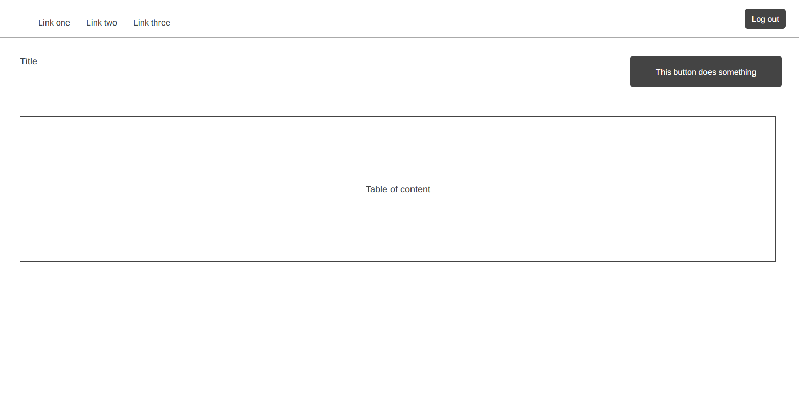

#### Dashboard (Hlavní stránka pro studenty)

**Účel:**  
Dashboard poskytuje studentovi přehled o aktuálním zápisovém období a dostupných blocích předmětů, do kterých se může zapsat. Ve stejném rozhraní probíhá i úprava zápisů.

**Vizuální struktura:**  

- Horní navigační panel (Top Bar) s odkazy na další sekce a tlačítkem **Log out**.
- Dva hlavní informační velké boxy:
  - **Term** – základní informace o zápisu.
  - **Start / End / State** – technické údaje o začátku, konci a stavu zápisu.
- Sekce s bloky předmětů:
  - Každý blok je zobrazen jako samostatná karta s nadpisem (např. *Blok 1*, *Blok 2*).
  - Uvnitř každého bloku je seznam výskytů předmětů reprezentovaný jako seznam položek.
  - Struktura je responzivní — bloky se zobrazují vedle sebe nebo pod sebou podle šířky obrazovky.

**Cílové chování:**  

- Student si může prohlédnout všechny dostupné bloky předmětů.  
- Podle stavu zápisu (OPEN/CLOSED) jsou zobrazené akce:
  - možnost zapsat se  
  - možnost odhlásit se  
- Dashboard slouží jako hlavní rozhraní pro interakci studenta s celým systémem.

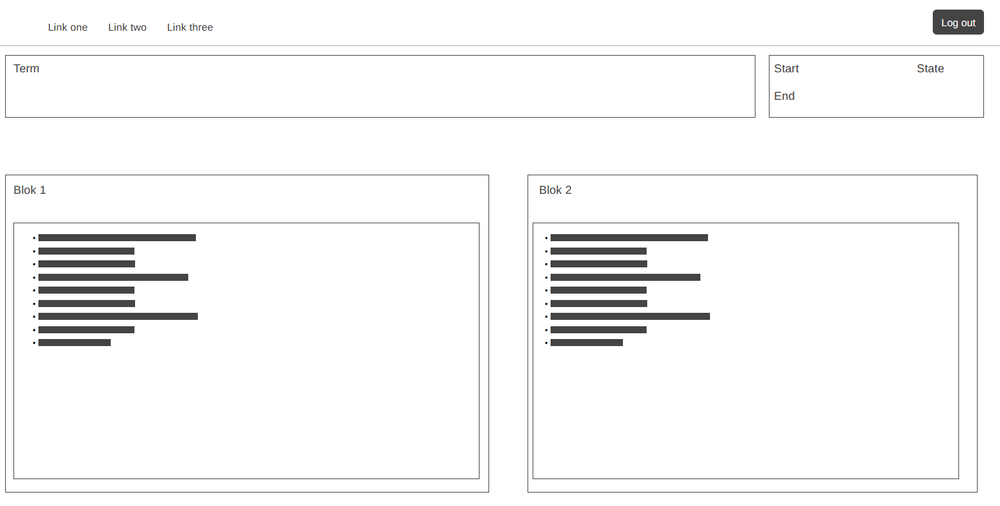

### 2. Strom stránek (Site Map)

Aplikace používá standardní adresářovou strukturu Next.js App Routeru.

Přihlášený uživatel vidí navigaci dle své role (ADMIN / TEACHER / STUDENT / GUEST).  
Nepřihlášený uživatel vidí pouze veřejnou úvodní stránku a formuláře pro přihlášení/registraci.

```bash
/app
├── (auth)/                  
│   ├── login/
│   │   └── page.tsx         # Přihlašovací formulář
│   └── register/
│       └── page.tsx         # Registrační formulář
│
├── api/
│   └── auth/
│       ├── [...nextauth]/
│       │   └── route.ts     # NextAuth.js API handler
│       └── register/
│           └── route.ts     # Registrační API endpoint
│
├── admin/
│   └── page.tsx             # Administrační centrum (pouze ADMIN)
│
├── dashboard/
│   └── page.tsx             # Hlavní stránka pro přihlášené (výběr zápisu)
│
├── subjects/                
│   ├── page.tsx             # Seznam všech předmětů
│   └── [id]/                # Dynamická routa pro konkrétní předmět
│       ├── page.tsx         # Detail předmětu
│       └── edit/
│           └── page.tsx     # Editace předmětu
│
├── enrollments/
│   ├── page.tsx             # Přehled všech zápisů
│   └── [id]/
│       └── page.tsx         # Detail zápisu
│
├── users/
│   └── page.tsx             # Přehled uživatelů (ADMIN: správa, TEACHER: jen čtení)
│
├── profile/
│   └── page.tsx             # Profil a změna hesla
│
├── settings/
│   └── page.tsx             # Nastavení systému (pouze ADMIN)
│
├── layout.tsx               # Klientský layout (AuthProvider + AppShell + AppTopbar)
├── globals.css              # Globální styly
└── page.tsx                 # Veřejná úvodní stránka (Landing page)

/middleware.ts               # Serverová ochrana rout (autentizace + autorizace)
```

### 3. Navigace (Top Bar Layout)

Aplikace používá horní navigační lištu (**Top Bar**), která se zobrazuje na všech stránkách pro přihlášené uživatele.  
Veřejné stránky (`/`, `/login`, `/register`) navigaci nenačítají.

- **Komponenta:** `AppShell` (client) a `AppTopbar`
- **Soubor:** `components/app-shell.tsx` a `components/app-topbar.tsx`
- **Struktura Top Baru:**
  1. **Vlevo – Logo / Název aplikace**
  2. **Uprostřed – Navigační odkazy (liší se podle role)**
  3. **Vpravo – Uživatelské menu**

#### Navigační odkazy (podle role)

Komponenta Top Baru zobrazí následující odkazy v závislosti na roli uživatele:

- **Role: `ADMIN`**
  - `Dashboard` → `/dashboard`
  - `Zápisy` → `/enrollments`
  - `Předměty` → `/subjects`
  - `Uživatelé` → `/users`
  - `Nastavení` → `/settings`

- **Role: `TEACHER`**
  - `Dashboard` → `/dashboard`
  - `Zápisy` → `/enrollments`
  - `Předměty` → `/subjects`
  - `Uživatelé` → `/users`

- **Role: `STUDENT`**
  - `Dashboard` → `/dashboard`

- **Role: `GUEST`**
  - `Dashboard` → `/dashboard`

### 4. Zadání pro programátora (Popis stránek)

#### /dashboard

Tato stránka je hlavní vstupní stránkou po přihlášení.  

- `/dashboard/page.tsx` je **Server Component**
- ověří session na serveru pomocí `getServerSession(authOptions)`
- vybere **jeden** vhodný zápis pomocí funkce `findDashboardEnrollment(...)`
- zobrazí obsah pomocí sdílené komponenty `EnrollmentView`
- Dashboard vždy zobrazí **jeden vybraný zápis**, nikoliv selektor zápisů.

##### Chování podle role

Implementace je zjednodušená — dashboard používá **stejný Layout a stejnou komponentu pro všechny role** (ADMIN, TEACHER, STUDENT, GUEST).

Rozdíly jsou pouze v tom, co jednotlivé role mohou **vidět** nebo **klikat**, ne v samotném layoutu.

Pro všechny  role dashboard funguje stejně:

1. Funkce `findDashboardEnrollment` vybere nejvhodnější zápis podle stavu (OPEN → SCHEDULED → DRAFT → CLOSED).

2. Pokud zápis existuje, zobrazí se.
3. Pokud zápis neexistuje, zobrazí se jednoduchá hláška: "Momentálně zde není žádné aktivní ani naplánované zápisové období."

---

###### Globální informace o zápisu (EnrollmentHeader)

Komponenta `EnrollmentHeader` zobrazuje:

- Název zápisu
- Datum začátku a konce
- Stav zápisu (`DRAFT`, `SCHEDULED`, `OPEN`, `CLOSED`)
- Tlačítko „Upravit zápis“ pro ADMIN/TEACHER  
  (otevírá dialog `EditEnrollmentDialog`)

###### Přehled bloků (EnrollmentBlocks)

Pod hlavičkou se zobrazuje mřížka bloků pomocí `EnrollmentBlocks` v layoutu podle velikosti displeje. Každý blok je potom reprezentován komponentou `EnrollmentBlockCard`.

EnrollmentBlockCard obsahuje:

- název bloku
- vizuální zvýraznění vybraného výskytu (pro STUDENT)
- tabulku výskytů předmětů (SubjectOccurrence)
- akce podle role uživatele

###### Chování STUDENT

Student může:

- vidět obsazenost výskytů (např. `5/30` nebo `2/∞`),
- zapsat se nebo odhlásit, pokud:
  - zápis má stav **OPEN**,
  - není již zapsán v jiném výskytu téhož bloku,
  - není zapsán na stejný předmět v jiném bloku.

###### Chování TEACHER a ADMIN

- Vidí všechny výskyty předmětů v daném bloku.
- Vidí jméno učitele a aktuální obsazenost.
- Kliknutím na obsazenost se otevře `OccurrencesStudentsDialog`.
- Tlačítka pro zápis jsou **neaktivní** (`disabled`).

ADMIN navíc může otevřít dialog pro úpravu výskytu.

###### Tabulka výskytů — sloupce

| Sloupec      | Popis                                                        |
|--------------|--------------------------------------------------------------|
| **Předmět**  | Název předmětu (klik vede na `/subjects/[id]`)               |
| **Učitel**   | Jméno vyučujícího                                            |
| **Obsazenost** | Např. `7/30` (pro TEACHER/ADMIN interaktivní)               |
| **Akce**     | STUDENT: Zapsat/Odhlásit, ostatní role: disabled tlačítka    |

Tabulka je založena na komponentě `DataTable` s vlastním setem sloupců.

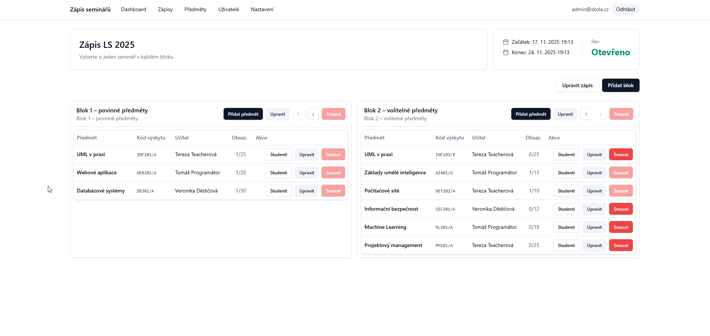
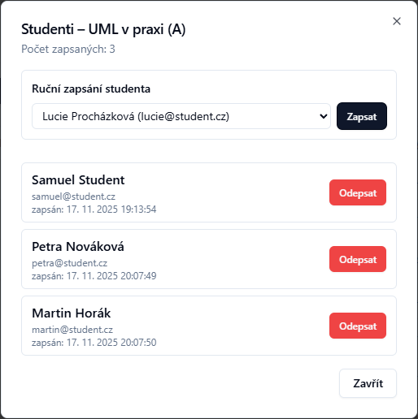

#### /subjects — Seznam předmětů

Stránka **/subjects** slouží k přehledu všech předmětů.  

##### Obsah stránky

Stránka obsahuje:

- nadpis a stručný popis,
- komponentu `DataTable` se seznamem předmětů,
- nástroje pro vyhledávání a filtrování,
- tlačítko pro vytvoření nového předmětu.

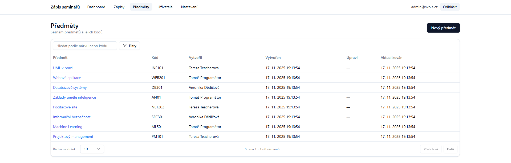

#### /subjects/[id] — Detail a editace předmětu

Stránka předmětu má dva režimy:

1. **Zobrazení detailu** — dostupné pro všechny přihlášené role  
2. **Editace** — dostupná pro role **TEACHER** a **ADMIN**

Následující popis odpovídá skutečné implementaci.

---

##### `/subjects/[id]/page.tsx` — Režim zobrazení

Stránka zobrazuje kompletní informace o vybraném předmětu (`Subject`) ve více sekcích.

Zobrazované údaje:

- Název předmětu
- Kód předmětu
- Krátký popis (`description`)
- Syllabus (`syllabus`)
- Výskyty předmětu (`SubjectOccurrence`)

Pod základními informacemi je tabulka všech výskytů daného předmětu napříč zápisy a bloky.

Tabulka zobrazuje sloupce:

- **Zápis** (název `EnrollmentWindow`)
- **Blok** (název `Block`)
- **Skupina** (subCode)
- **Vyučující**
- **Kapacita**
- **Obsazenost**

Tabulka je postavená pomocí komponenty `DataTable`.

---

Role TEACHER/ADMIN mají v pravé horní části tlačítko **„Upravit“**, které vede na `/subjects/[id]/edit`.

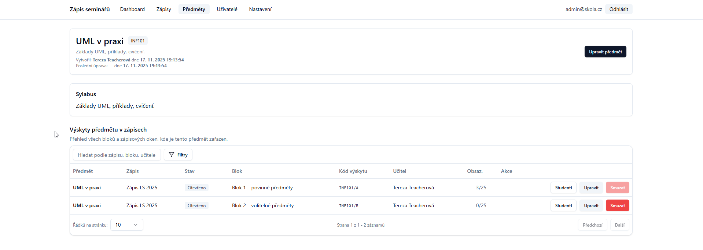

##### `/subjects/[id]/edit/page.tsx` — Režim editace

Stránka umožňuje upravit základní informace o předmětu.  
Je dostupná pro role **TEACHER** a **ADMIN**.

Editační formulář obsahuje:

- `Input` — název předmětu (`name`)
- `Input` — kód předmětu (`code`)
- `Textarea` — krátký popis (`description`)
- **Rich Text Editor (Tiptap)** — detailní popis (`syllabus`)
  - podpora formátování (nadpisy, tučné, kurzíva, seznamy)

###### Akce tlačítek

Stránka obsahuje následující akce:

- **Uložit**  
  - Aktualizuje hodnoty předmětu v paměti
  - Zobrazí toast o úspěšném uložení
  - Přesměruje zpět na detail (`/subjects/[id]`)

- **Zrušit**  
  - Přesměruje zpět bez uložení

- **Smazat předmět**  
  - V aktuální verzi není implementováno (tlačítko se nezobrazuje)
  
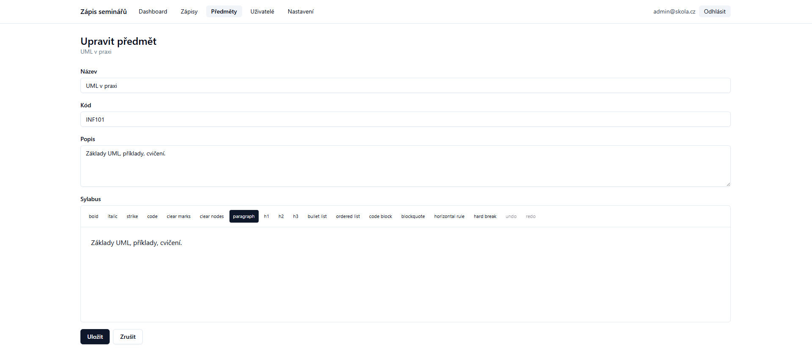

#### /enrollments

Stránka **/enrollments** slouží k přehledu zápisových období (`EnrollmentWindow`).  
Je určena pro role **ADMIN** a **TEACHER**, které ji mají dostupnou v navigaci.

---

##### Funkce stránky

Stránka zobrazuje tabulku zápisů s informacemi o:

- názvu a stavu zápisu,
- viditelnosti pro studenty,
- termínu začátku a konce,
- počtu bloků a počtu předmětů v blocích,
- počtu zapsaných studentů,
- počtu studentů, kteří mají zápis kompletně vyplněný (mají zapsaný předmět ve všech blocích).

Používá se komponenta `DataTable` s vyhledáváním, filtrováním a tříděním na straně klienta.

---

##### Ovládací prvky

V horní části stránky jsou:

- **Nadpis a popis:**
  - `Zápisová období`
  - krátký popis („Přehled všech zápisů, bloků a počtu unikátních studentů.“)

- **Tlačítko „Vytvořit nový zápis“**  
  - zobrazuje se pouze pro roli **ADMIN**  
  - otevře dialog pro zadání názvu, popisu, stavu, časového rozmezí a viditelnosti zápisu

Pod hlavičkou je komponenta `DataTable` s těmito funkcemi:

- **Vyhledávání:**
  - `searchPlaceholder="Hledat podle názvu."`
  - fulltext vyhledává v názvu zápisu

- **Filtry:**
  - **Select „Stav“**  
    - hodnoty: Koncept (`DRAFT`), Naplánováno (`SCHEDULED`), Otevřeno (`OPEN`), Uzavřeno (`CLOSED`)
  - **Select „Viditelnost“**  
    - „Viditelné studentům“ (`visibleToStudents = true`)  
    - „Skryté studentům“ (`visibleToStudents = false`)
  - **Datumové filtry:**
    - `Začátek` – filtr podle `startsAt`
    - `Konec` – filtr podle `endsAt`

---

##### Sloupce tabulky

Tabulka obsahuje následující sloupce:

| Sloupec | Popis |
|---------|-------|
| **Název** | Název zápisu. Kliknutím na název se otevře stránka `/enrollments/[id]`. Pod názvem může být zobrazen krátký popis. |
| **Stav** | Zobrazen jako barevný `Badge` (Koncept, Naplánováno, Otevřeno, Uzavřeno). |
| **Viditelné pro studenty** | Hodnota „Ano/Ne“ zobrazená jako `Badge`. |
| **Začátek** | Datum a čas začátku zápisu (`startsAt`). |
| **Konec** | Datum a čas konce zápisu (`endsAt`). |
| **Bloky (předměty)** | Seznam bloků s počtem výskytů v každém bloku (např. „Blok 1 [3]“). |
| **Zapsaní studenti** | Počet unikátních studentů zapsaných v rámci zápisu. |
| **Kompletně zapsaní** | Počet studentů, kteří mají zapsán předmět ve všech blocích daného zápisu. |
| **Akce** | Kontextové tlačítko pro úpravu (podle role). |

---

##### Práva a akce podle role

###### Role ADMIN

- Vidí všechna zápisová období v tabulce.
- V hlavičce má k dispozici tlačítko **„Vytvořit nový zápis“**, které:
  - otevře dialog pro vytvoření zápisu,
  - umožní nastavit název, popis, stav, časové rozmezí a viditelnost.

- Ve sloupci **Akce** má k dispozici tlačítko:

  - **„Upravit zápis“**  
    - otevře dialog pro úpravu vybraného zápisu  
    - po uložení se dialog zavře a stránka se obnoví

###### Role TEACHER

- Vidí stejnou tabulku zápisů jako ADMIN (včetně filtrů a statistik).
- **Nevidí** tlačítko „Vytvořit nový zápis“.
- Ve sloupci **Akce** se tlačítko „Upravit zápis“ nezobrazuje.

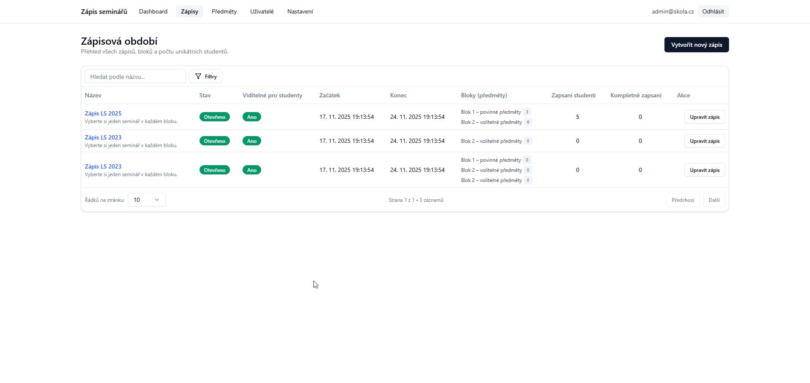

#### /enrollments/[id]

Stránka **/enrollments/[id]** zobrazuje detail jednoho zápisového období (`EnrollmentWindow`). Stránka znovu využívá **stejné komponenty jako dashboard**.

Je dostupná pro role, které mají odkaz v navigaci ( **ADMIN** a **TEACHER**).

#### /users

Stránka **/users** slouží k přehledu a správě uživatelů.  
Je přístupná pro role **ADMIN** (plný přístup) a **TEACHER** (jen čtení).

##### Obsah stránky users

Stránka `/users` obsahuje:

- nadpis a stručný popis,
- komponentu `DataTable` se seznamem uživatelů,
- nástroje pro vyhledávání, filtrování a hromadné akce,
- akční menu pro úpravu jednoho konkrétního uživatele.

##### Přístupová práva

- **ADMIN**: Plný přístup – může měnit role, aktivaci, resetovat hesla, importovat uživatele, provádět hromadné akce.
- **TEACHER**: Pouze čtení – vidí seznam uživatelů a jejich zápisy, ale **nemůže měnit role, resetovat hesla, importovat ani provádět hromadné akce**. Tlačítka pro import, karta systémového ročníku a hromadné akce jsou automaticky skryté.

##### Načítání dat

- Načítají se **všichni uživatelé** z aktuálního datasetu.
- Vyhledávání, filtrování, třídění a výběr probíhá **na klientu** (bez serverových volání).

##### Ovládací prvky uživatelů

Nad tabulkou jsou dostupné tyto prvky:

- **Fulltext vyhledávání** v `firstName`, `lastName`, `email`.
- **Filtry** podle role, stavu, datumu vytvoření nebo datumu posledního přihlášení

##### Sloupce tabulky uživatelů

Tabulka obsahuje následující sloupce:

| Sloupec | Popis |
|---------|--------|
| **Jméno** | Kombinace jména a příjmení |
| **E-mail** | E-mail uživatele |
| **Role** | Barevný Badge s hodnotou role |
| **Stav** | Badge „Aktivní“ / „Neaktivní“ |
| **Vytvořen** | Datum vytvoření uživatele |
| **Poslední přihlášení** | Datum posledního přihlášení |

##### Hromadné akce

Tabulka nabízí vedle filtrů i možnost hromadných změn, kdy se akce provedou nad všemi aktuálně vyfitrovanými záznamy.

- **Změna role** — dropdown pro výběr nové role
- **Aktivovat vybrané**
- **Deaktivovat vybrané**

##### Akce v řádku

V každém řádku je kontextové menu (`DropdownMenu`) pro změnu role a přepínač pro aktivování/deaktivovaní uživatelů:

Detaily uživatele se nezobrazují na vlastní stránce — vše je řešeno přímo v tabulce pomocí inline akcí a hromadného panelu.

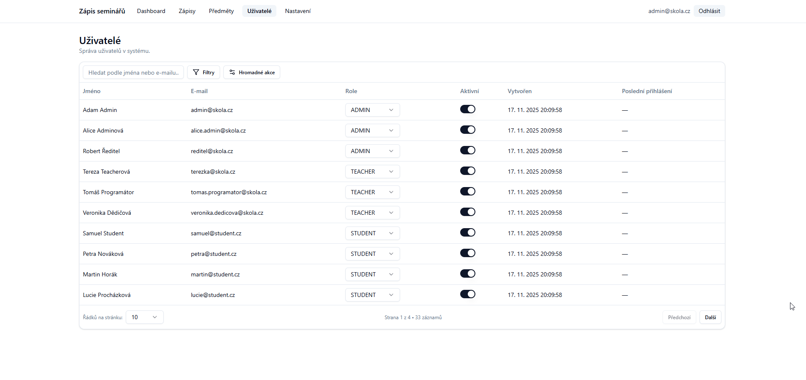

#### /settings

Stránka je dostupná **pouze pro ADMINA**. Na začátku `page.tsx` je nutné ověřit roli, jinak `redirect`. AKtuálně jsou všechny nastavení napevno v kódu, ale při nasazení by byly jednotlivé zadávací pole pro texty níže.

**Komponenty:**

- **`<Tabs>`:** Hlavní navigace stránky.
  - **Tab 1: "Obecné"**
    - **Karta "Role":**
      - `CardHeader`: "Výchozí role uživatelů"
      - `CardContent`: Obsahuje `Select` s popiskem "Role pro nově schválené uživatele".
      - Možnosti: `STUDENT`, `TEACHER`. (Určuje, jakou roli získá `GUEST` poté, co ho admin "schválí" na stránce `/users`).
      - `CardFooter`: `Button` ("Uložit").
    - **Karta "Registrace":**
      - `CardHeader`: "Omezení registrace"
      - `CardContent`: `Input` s popiskem "Povolené e-mailové domény (oddělte čárkou)".
      - `CardDescription`: "Např: `@skola.cz`. Pokud je prázdné, registrace je povolena pro jakýkoliv e-mail."
      - `CardFooter`: `Button` ("Uložit").
  - **Tab 2: "Texty"**
    - **Karta "Text pro GUEST":**
      - `CardHeader`: "Text na Dashboardu (Role GUEST)"
      - `CardContent`: Obsahuje `Textarea` pro úpravu textu, který vidí uživatel s rolí `GUEST`.
      - `CardFooter`: `Button` ("Uložit").
    - **Karta "Text pro 'Žádný zápis'":**
      - `CardHeader`: "Text na Dashboardu (Žádný zápis)"
      - `CardContent`: Obsahuje `Textarea` pro úpravu textu, který vidí přihlášený uživatel, pokud není aktivní žádný `EnrollmentWindow`.
      - `CardFooter`: `Button` ("Uložit").
  - **Tab 3: "Pokročilé" (Prázdná pro budoucí použití)**

## Technická architektura

### Technologický stack

| Technologie | Verze | Účel |
|---|---|---|
| **Next.js** | 14.x | Fullstack framework (App Router, Server Components, Server Actions) |
| **React** | 18.3 | UI knihovna |
| **TypeScript** | 5.6 | Typový systém |
| **Prisma** | 6.19 | ORM pro práci s PostgreSQL |
| **PostgreSQL** | — | Relační databáze |
| **NextAuth.js** | 4.x | Autentizace (JWT, Credentials provider) |
| **TailwindCSS** | 3.4 | Utility-first CSS framework |
| **shadcn/ui** | — | Komponentová knihovna (Radix UI primitiva) |
| **TanStack Table** | 8.x | Headless tabulková knihovna |
| **Tiptap** | 3.x | Rich text editor (pro sylabus) |
| **bcryptjs** | 3.x | Hashování hesel |
| **Sonner** | 2.x | Toast notifikace |
| **Lucide React** | — | Ikonová knihovna |
| **date-fns** | 4.x | Práce s datumy |

### Architektura aplikace

```
┌─────────────────────────────────────────────────────┐
│                    Klient (Browser)                  │
│  ┌─────────────┐  ┌──────────────┐  ┌────────────┐  │
│  │ React Pages │  │  shadcn/ui   │  │  useAuth() │  │
│  │  (App Router│  │  Components  │  │  Context   │  │
│  └──────┬──────┘  └──────────────┘  └────────────┘  │
└─────────┼───────────────────────────────────────────┘
          │ Server Actions / fetch
┌─────────┼───────────────────────────────────────────┐
│         ▼          Server (Next.js)                  │
│  ┌─────────────┐  ┌──────────────┐  ┌────────────┐  │
│  │ middleware  │  │  lib/data.ts │  │ lib/auth.ts│  │
│  │   .ts       │→ │ Server       │  │ NextAuth   │  │
│  │ (Auth guard)│  │ Actions      │  │ Config     │  │
│  └─────────────┘  └──────┬───────┘  └────────────┘  │
│                          │ Prisma Client             │
│                   ┌──────▼───────┐                   │
│                   │  PostgreSQL  │                   │
│                   │  (Prisma)    │                   │
│                   └──────────────┘                   │
└─────────────────────────────────────────────────────┘
```

### Bezpečnostní architektura

Aplikace implementuje bezpečnost ve **třech vrstvách**:

1. **Middleware (`middleware.ts`)**  
   - Běží na edge serveru před každým požadavkem.
   - Ověřuje JWT token – nepřihlášení uživatelé jsou přesměrováni na `/login`.
   - Role-based routing: `/admin` je přístupné pouze pro `ADMIN`, `/users` pouze pro `ADMIN` a `TEACHER`.

2. **Server Actions (`lib/data.ts`)**  
   - Každá mutace i čtení dat ověřuje session pomocí `requireAuth()`, `requireAdmin()` nebo `requirePrivileged()`.
   - Studenti mohou operovat pouze se svým vlastním účtem.
   - Hosté (`GUEST`) nemohou provádět žádné mutace zápisů.

3. **UI vrstva (React komponenty)**  
   - Tlačítka a akce jsou podmíněně skrytá/deaktivovaná dle role.
   - Slouží jako UX vrstva – bezpečnost je vždy ověřována na serveru.

### Autentizace a autorizace

- **Provider:** NextAuth.js s `CredentialsProvider` (email + heslo).
- **Strategie:** JWT (bezstavové tokeny), bez serverové session.
- **Hashování hesel:** bcryptjs se salt factor 10.
- **Login flow:** Uživatel zadá email/heslo → server ověří hash → vygeneruje JWT token → uložen do httpOnly cookie.
- **Session data v tokenu:** `id`, `role`, `firstName`, `lastName`, `isActive`.
- **Poslední přihlášení:** Automaticky aktualizováno v `User.lastLoginAt` při každém přihlášení.

### Datová vrstva

- **ORM:** Prisma s PostgreSQL.
- **Singleton pattern:** Prisma Client je sdílen přes `lib/prisma.ts` (zamezení connection pool exhaustion).
- **Serializace:** Výsledky Prisma dotazů jsou serializovány pomocí `JSON.parse(JSON.stringify(...))` pro kompatibilitu s Server Actions.
- **Soft delete:** Entity `Block`, `SubjectOccurrence` a `StudentEnrollment` podporují soft delete (`deletedAt` + `deletedById`).
- **Audit trail:** Všechny entity mají `createdById`, `updatedById` a případně `deletedById`.

### Synchronizace stavu zápisových oken

Systém implementuje **lazy synchronizaci** stavu zápisových oken s aktuálním serverovým časem:

1. Při každém načtení dat (`getEnrollmentWindowsWithDetails`, `getEnrollmentWindowByIdWithBlocks`, `getEnrollmentWindowsVisible`) se volá funkce `syncEnrollmentWindowStatus()`.
2. Tato funkce porovná DB stav s výsledkem `computeEnrollmentStatus()` (který počítá stav na základě `startsAt`, `endsAt` a aktuálního času).
3. Pokud je nesoulad:
   - `SCHEDULED` + čas je po `startsAt` → přepne na `OPEN`
   - `OPEN` + čas je po `endsAt` → přepne na `CLOSED`
   - `DRAFT` se nikdy nepřepíná automaticky
4. Stav se aktualizuje přímo v databázi — všechny následné načtení vrátí korektní stav.

### Transakční integrita zápisů

Funkce `enrollStudent()` provádí všechny kontroly a samotný zápis v rámci **serializovatelné Prisma transakce** (`isolationLevel: 'Serializable'`):

- Kontrola kapacity semináře
- Kontrola duplicity v bloku (max 1 zápis na blok)
- Kontrola duplicity předmětu v rámci okna
- Validace stavu zápisového okna (serverový čas)
- Vytvoření zápisu

Toto zamezuje race conditions, kdy by dva studenti mohli současně obsadit poslední místo.

### Struktura klíčových souborů

| Soubor | Účel |
|---|---|
| `middleware.ts` | Serverová ochrana rout (JWT ověření, role-based routing) |
| `lib/auth.ts` | Konfigurace NextAuth.js (providers, callbacks, events) |
| `lib/data.ts` | Všechny Server Actions – CRUD operace, autorizace, validace |
| `lib/prisma.ts` | Singleton instance Prisma Client |
| `lib/utils.ts` | Utility funkce (`cn`, `computeEnrollmentStatus`) |
| `lib/types.ts` | TypeScript typy (`User`, `Subject`, `EnrollmentWindow`, atd.) |
| `components/auth/auth-provider.tsx` | React context pro autentizaci (`useAuth()`) |
| `components/app-topbar.tsx` | Navigační lišta s role-based odkazy |
| `components/app-shell.tsx` | Layout wrapper (topbar + obsah) |
| `prisma/schema.prisma` | Definice databázového schématu |

---

## Lighthouse Report

Tato kapitola shrnuje výsledky automatizovaného auditu pomocí nástroje **Google Lighthouse**.  
Audit byl proveden nad stránkou **/dashboard** v produkční verzi aplikace  
**<https://seminar-is.vercel.app>**.

### 📈 Výsledné skóre

| Kategorie         | Skóre |
|-------------------|-------|
| **Performance**   | **100 / 100** |
| **Accessibility** | **95 / 100** |
| **Best Practices**| **100 / 100** |
| **SEO**           | **100 / 100** |

---

### ⚡ Performance (100 %)

Aplikace dosáhla maximálního skóre díky velmi rychlému vykreslení:

- **First Contentful Paint:** 0.2 s :contentReference[oaicite:4]{index=4}  
- **Largest Contentful Paint:** 0.5 s :contentReference[oaicite:5]{index=5}  
- **Speed Index:** 0.6 s :contentReference[oaicite:6]{index=6}  
- **Total Blocking Time:** 0 ms :contentReference[oaicite:7]{index=7}  
- **Cumulative Layout Shift:** 0 :contentReference[oaicite:8]{index=8}  

Výborný výkon je dosažen kombinací:

- rychlého renderingu díky Next.js server components,
- minimální velikosti bundle (cca 247 KiB) :contentReference[oaicite:9]{index=9},
- žádných blokujících skriptů ani přesměrování.

---

### Accessibility (95 %)

Skóre přístupnosti je velmi vysoké. Lighthouse upozornil pouze na:

- **jeden problém s kontrastem textu** na tlačítkách (červená šedá)  
- několik doporučení k manuálnímu ověření (fokus, pořadí tab indexu atd.)

Nic z toho zásadně nebrání použití aplikace — jde o drobná doporučení.

---

### Best Practices (100 %)

Aplikace splňuje všechny moderní vývojové standardy:

- běží kompletně přes HTTPS,
- nepoužívá zastaralé API,
- žádné chyby v konzoli,
- správná bezpečnostní nastavení,
- vhodné načítání zdrojů.

Celá sekce prošla bez jediného varování.

---

### SEO (100 %)

Přestože je aplikace interní, Lighthouse potvrzuje, že:

- všechny stránky mají validní HTML,
- stránka má meta description, viewport a ostatní náležitosti,
- neobsahuje žádné indexační chyby.

SEO je plně optimalizované — skóre 100 / 100.

---

### Shrnutí

Aplikace podle Lighthouse dosahuje vynikajících výsledků:

- **maximální výkon i best practices**,  
- **velmi dobrá přístupnost**,  
- **vynikající technická čistota a optimalizace**.

Identifikované drobnosti (kontrast textu) lze snadno doladit v budoucí verzi.  
Celkově systém splňuje standardy moderní webové aplikace.

## ESLint

Pro statickou analýzu zdrojového kódu na straně frontendu je v projektu použit nástroj **ESLint** (integrovaný pomocí `next lint`).

ESLint slouží k automatickému odhalování chyb a nekonzistencí v kódu ještě před jeho spuštěním. Pomáhá zvyšovat čitelnost, udržovatelnost a celkovou kvalitu projektu.
Používá sadu pravidel zaměřených na správné používání TypeScriptu, Reactu a doporučených praktik Next.js.

Analýza je spouštěna příkazem:

```bash
npm run lint
```

### Detekované problémy a jejich význam

ESLint odhalil několik hlavních kategorií problémů, které se v projektu opakují:

---

### 1. Typování pomocí `any`

**Chyby typu:**

```typescript
Error: Unexpected any. Specify a different type.
```

**Výskyt např. v:**

- `app/(auth)/login/page.tsx`
- `app/enrollments/page.tsx`
- `app/subjects/[id]/page.tsx`
- `components/ui/data-table.tsx`
- `components/blocks/EnrollmentBlockCard.tsx`

**Význam:**
Použití `any` snižuje typovou bezpečnost. TypeScript tím ztrácí schopnost odhalovat chyby v hodnotách na vstupu i výstupu funkcí.

**Návrh řešení:**

- Nahrazovat `any` konkrétními typy (např. `User`, `Subject`, `EnrollmentWindow`).
- U tabulek a sloupců využít generické typy (`TData`, `TValue`).
- Pokud má být `any` jen dočasné, lze ho přepsat alespoň na `unknown`.

---

### 2. Nepoužité proměnné (no-unused-vars)

**Chyby typu:**

```typescript
Error: 'b' is defined but never used.
Error: 'isPublicPage' is assigned a value but never used.
```

**Výskyt např. v:**

- `dashboard/page.tsx`
- `components/app-shell.tsx`
- `components/auth/auth-provider.tsx`
- `lib/data.ts`
- `components/occurrences/EditSubjectOccurrenceDialog.tsx`

**Význam:**
Nepoužité proměnné zhoršují čitelnost a často ukazují na nedokončený nebo "mrtvý" kód.

**Návrh řešení:**

- Odebrat nepoužívané proměnné a importy.
- Pokud je potřeba proměnnou ponechat, přejmenovat ji na `_name` a upravit ESLint, aby ignoroval podtržítko.

---

### 3. Nesprávné použití React Hooks

**Chyby typu:**

```plaintext
React Hook "useState" is called conditionally.
React Hook "useMemo" is called conditionally.
React Hook is called in function that is not a component.
```

**Výskyt např. v:**

- `app/enrollments/page.tsx`
- `subjects/[id]/page.tsx`
- `components/users/columns.tsx`
- `components/occurrences/OccurrencesStudentsDialog.tsx`

**Význam:**
React Hooks musí být volány vždy ve stejném pořadí. Pokud jsou uvnitř `if`, `for`, nebo v obyčejných funkcích, může to vést k runtime chybám a nekonzistentnímu stavu komponent.

**Návrh řešení:**

- Přesunout hooky do horní úrovně komponent.
- U tabulkových „cell“ rendererů vytvořit malé komponenty (např. `<RoleCell />`, `<ActionsCell />`) a hooky volat uvnitř nich.
- Vyhnout se podmíněnému volání hooků.

---

### 4. Neescapované uvozovky v JSX

**Chyby typu:**

```javascript
Error: '"' can be escaped with &quot; ...
```

**Výskyt např. v:**

- `EditEnrollmentDialog.tsx`

**Návrh řešení:**

- Nahradit `"` za `&quot;`.
- Nebo přepsat text tak, aby uvozovky nebyly v běžném JSX literálu.

---

### Shrnutí přínosů ESLintu

ESLint významně přispěl k odhalení:

- Nadměrného používání `any`.
- Nepoužívaného a „mrtvého“ kódu.
- Potenciálně nebezpečných vzorů v práci s React Hooks.
- Drobných problémů v syntaxi JSX.

Díky těmto výsledkům lze v dalších iteracích projektu provést úpravy, které zvýší bezpečnost, přehlednost a udržovatelnost celého systému. ESLint tak slouží jako automatizovaný nástroj kvality, srovnatelný s průběžným code review.

## Zadavací dokumentace

Tento dokument je možné použít jako **zadávací dokumentace** celého systému.  
Obsahuje kompletní popis všech funkčních požadavků, uživatelských rolí, toků aplikace, pravidel zápisu, struktury stránek i způsobu zpracování dat.  

Dokumentace je strukturována tak, aby ji bylo možné přímo použít jako:

- **zadání pro vývojáře**,  
- **specifikaci pro zadavatele**,  
- **referenční popis chování hotového systému**,  
- **podklad pro prezentaci nebo schválení projektu**.

Všechny kapitoly společně tvoří ucelený přehled, který pokrývá hlavní funkční i nefunkční požadavky. Na základě této dokumentace je možné nezávisle systém navrhnout, implementovat nebo dále rozšiřovat.

Systém je popsán do takové hloubky, že dokumentace může být využita i jako finální **předávací dokument**, protože přesně popisuje aktuálně implementované funkcionality, uživatelské rozhraní i technické komponenty.
