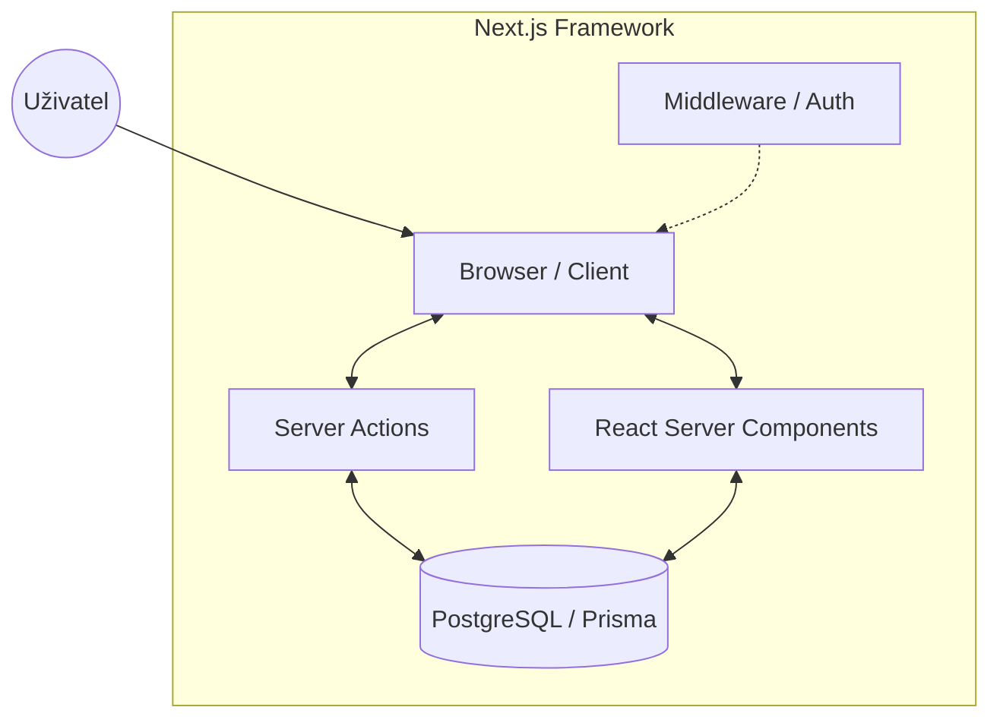

# Komplexní popis systému - Zápis seminářů

Tento dokument poskytuje ucelený technický a funkční popis systému **Zápis seminářů**. Spojuje aspekty uživatelského rozhraní (Front-end) i vnitřní logiky (Back-end) do jednoho celku určeného pro odborné pedagogy, vývojáře a zadavatele.

---

## 1. Úvod a Motivace

Systém vznikl jako přehledný a interaktivní nástroj pro **organizaci školních seminářů a zápisů studentů**. Cílem bylo eliminovat ruční evidenci v tabulkových procesorech a e-mailovou komunikaci a nahradit ji automatizovaným, transparentním procesem.

### Hlavní cíle systému:
-   **Studenti**: Intuitivní výběr seminářů s okamžitou zpětnou vazbou o kapacitě.
-   **Učitelé**: Přehled o obsazenosti skupin a přístup k seznamům zapsaných studentů.
-   **Administrátoři**: Plná správa předmětů, bloků, zápisových oken a uživatelských účtů.
-   **Organizace**: Zajištění integrity dat (zamezení over-enrollmentu) a vysoký výkon i při špičkách.

---

## 2. Technická Architektura

Systém je postaven jako moderní full-stack webová aplikace na frameworku **Next.js 14**.

### Globální model:
Aplikace využívá hybridní model, kde většina logiky probíhá na straně serveru (Server-side rendering), což zajišťuje bezpečnost a bleskový start.

### Klíčové technologické pilíře:
-   **React Server Components (RSC)**: Zobrazení dat bez nutnosti API volání z prohlížeče.
-   **Server Actions**: Bezpečné mutace dat přímo na serveru s built-in CSRF ochranou.
-   **Streaming & Suspense**: Postupné načítání částí stránky pro lepší uživatelský zážitek.
-   **TypeScript**: Striktní typování napříč celým zásobníkem.

---

## 3. Uživatelské role a Use Case

Systém rozlišuje čtyři základní úrovně oprávnění, které definují rozsah přístupu k funkcionalitám.

| Role | Popis a oprávnění |
| :--- | :--- |
| **GUEST** | Nově registrovaný uživatel. Má přístup pouze k přehledu zápisů bez možnosti interakce. |
| **STUDENT** | Může se zapisovat do otevřených oken. Omezen na 1 předmět/blok a unikátnost předmětu v rámci okna. |
| **TEACHER** | Spravuje sylaby předmětů, vidí seznamy studentů a přehled uživatelů (read-only). |
| **ADMIN** | Plná kontrola nad systémem, uživateli, rolemi, exporty dat a konfigurací zápisových oken. |

### Klíčové scénáře:
1.  **Student**: Registrace -> Schválení adminem -> Výběr semináře v otevřeném bloku -> Potvrzení (zápis do DB).
2.  **Admin**: Vytvoření předmětu -> Sestavení okna a bloků -> Nastavení časového rozvrhu -> Export výsledků po uzavření.

---

## 4. Datový model (Databázové schéma)

Jádrem systému je PostgreSQL databáze, která zajišťuje vysokou konzistenci dat.

### Klíčové entity:

#### User (Uživatel)
| Role | Popis |
| :--- | :--- |
| `id` | CUID (unikátní identifikátor). |
| `role` | Role uživatele (GUEST -> ADMIN). |
| `isActive` | Přepínač přístupu (soft-kill). |
| `cohort` | Ročník studenta (např. 2023/2024). |

#### EnrollmentWindow & Block
Zápis je rozdělen na **Okna** (časový rámec) a **Bloky** (logické skupiny předmětů, např. "Přírodní vědy").

#### Subject & SubjectOccurrence
-   **Subject**: Trvalá definice (název, kód, sylabus).
-   **Occurrence**: Konkrétní skupina v bloku s učitelem a nastavenou **kapacitou**.

### Integrita a Audit Trail:
Všechny podstatné změny (zápis, smazání, úprava) sledují pole `createdById` a `updatedById`. Smazané záznamy využívají **Soft Delete** (`deletedAt`), aby byla zachována historie pro reporty.

---

## 5. Bezpečnost a Autentizace

Aplikace implementuje vícevrstvou bezpečnost:

1.  **Autentizace**: Pomocí **NextAuth.js** (JWT strategie). Hesla jsou hashována algoritmem **bcryptjs**.
2.  **Autorizace (Edge)**: Middleware kontroluje oprávnění dříve, než se požadavek dostane k aplikační logice.
3.  **Autorizace (Logic)**: Server Actions interně volají guardy (`requireAdmin`), které re-verifikují identitu na serveru.
4.  **SQL Injection**: Díky Prisma ORM jsou všechny dotazy automaticky parametrizovány.

---

## 6. Technologický stack

| Technologie | Verze | Účel |
| :--- | :--- | :--- |
| **Next.js** | 14.x | Jádro aplikace (App Router) |
| **Prisma** | 6.19 | ORM pro PostgreSQL |
| **shadcn/ui** | — | Komponentová knihovna (Radix UI) |
| **Tailwind CSS** | 3.4 | Styling a responzivita |
| **TanStack Table**| 8.x | Pokročilé filtrování a řazení dat |
| **bcryptjs** | 3.x | Bezpečné hashování hesel |

---

## 7. Implementační detaily a Kvalita

### Transakční integrita zápisů
Kritická operace `enrollStudent` probíhá v **serializovatelné transakci**. To zaručuje, že i když se dva studenti pokusí zapsat na poslední volné místo ve stejnou milisekundu, systém jednoho z nich korektně odmítne a zabrání přeplnění kapacity.

### Lighthouse Report
Systém byl podroben auditům kvality (na adrese `https://seminar-is.vercel.app`):
-   **Performance**: 100%
-   **Best Practices**: 100%
-   **SEO**: 100%
-   **Accessibility**: 95% (vysoká přístupnost pro uživatele s handicapem).

### ESLint a Typová bezpečnost
Celý projekt je pravidelně podrobován statické analýze. TypeScript v režimu `strict` zajišťuje, že chyby v datech jsou odhaleny již během vývoje.

---

## 8. Testování a Monitoring

### Uživatelské testování (QA checklist):
-   [ ] **Registrační flow**: Účet vzniká jako GUEST, nelze se přihlásit po deaktivaci.
-   [ ] **Kapacitní test**: Pokus o zápis do plného semináře musí skončit chybou.
-   [ ] **Kolizní test**: Student se nesmí zapsat na stejný předmět dvakrát.
-   [ ] **Časový test**: Automatické otevření/zavření okna v nastavený čas.

### Monitoring:
Využíváme **Vercel Speed Insights** pro sledování reálného výkonu a **Prisma Query Logs** pro optimalizaci databázových dotazů.

---

## 9. Tým a kompetence

*Tato sekce bude doplněna členy týmu.*
-   **Skupina / Tým číslo**: [DOPLNIT]
-   **Role**: [DOPLNIT]
-   **Celkový čas vývoje**: [DOPLNIT]

---

## 10. Závěr a Zdroje

Systém "Zápis seminářů" představuje robustní, škálovatelné a bezpečné řešení, které plně reflektuje potřeby moderní vzdělávací instituce. Díky využití špičkových technologií jako Next.js 14 a PostgreSQL je připraven na reálné nasazení.

### Zdroje:
-   [Dokumentace Next.js](https://nextjs.org/docs)
-   [Prisma Reference](https://www.prisma.io/docs)
-   [Shadcn/UI Components](https://ui.shadcn.com)
