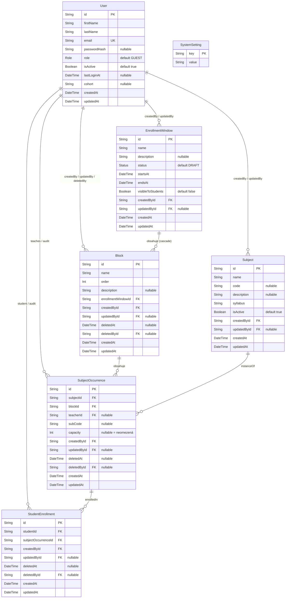
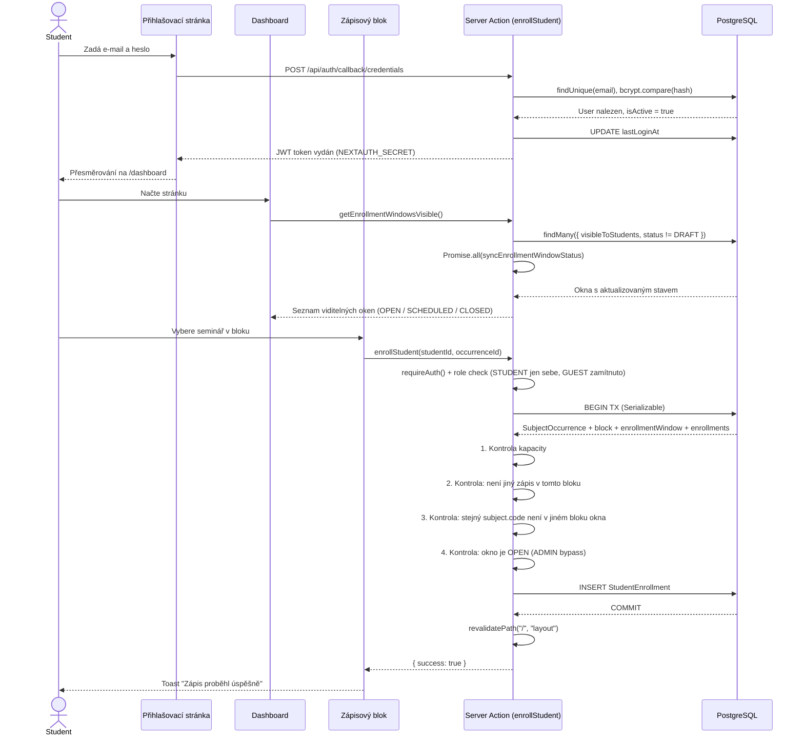
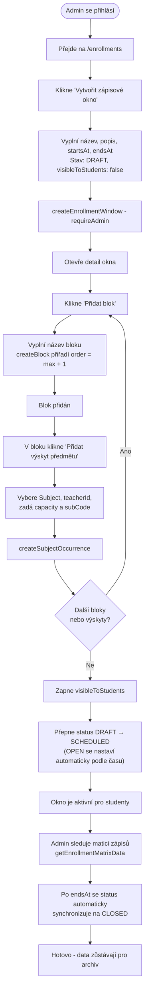

# Dokumentace projektu – Systém zápisu seminářů

**Název projektu:** SeminarIS – Online systém zápisu seminářů  
**Číslo skupiny:** `[DOPLNIT]`  
**Repozitář:** `[DOPLNIT]`  
**Nasazená verze:** `[DOPLNIT]`

---

## 1. Úvod

SeminarIS je webová aplikace určená k organizaci a online správě zápisu volitelných seminářů na střední škole. Nahrazuje papírové formuláře a ruční administrativní procesy digitálním řešením dostupným z libovolného zařízení s webovým prohlížečem.

Aplikace je postavena na frameworku **Next.js 14** (App Router, Server Actions, React Server Components), databázovou vrstvu tvoří **PostgreSQL** přes **Prisma ORM 6**, autentizace běží na **NextAuth.js v4** s JWT session strategií. Systém je nasazen na platformě **Vercel**.

---

## 2. Cíle

### Co aplikace řeší

Školy tradičně organizují zápis do volitelných předmětů či seminářů pomocí papírových formulářů nebo sdílených tabulek. Tento přístup je náchylný k chybám, obtížně koordinovatelný a časově náročný. SeminarIS tento proces plně digitalizuje – od administrátorské přípravy zápisových oken až po samotný zápis studenta s okamžitou kontrolou kapacity.

### Pro koho je určena

| Role | Popis |
|------|-------|
| **Student** | Zapisuje sám sebe do seminářů v rámci aktivního zápisového okna; vidí pouze okna s `visibleToStudents = true` a stavem ≠ DRAFT |
| **Učitel (Teacher)** | Prohlíží zápisy a spravuje studenty, má přístup do sekce `/users`, může vytvářet a editovat předměty |
| **Administrátor (Admin)** | Plná správa systému – předměty, zápisová okna, bloky, výskyty předmětů, uživatelé a globální nastavení |
| **Host (Guest)** | Výchozí role po běžné registraci – může se přihlásit, ale nemůže se zapisovat do seminářů, dokud jej admin nepovýší |

### Klíčové požadavky

- Zápis probíhá v reálném čase a systém automaticky hlídá kapacitní limity.
- Zápisová okna mají přesně definovaný časový rozsah; jejich stav (SCHEDULED → OPEN → CLOSED) se automaticky mění podle aktuálního času.
- Semináře jsou rozděleny do bloků a student si v každém bloku vybírá právě jeden seminář.
- Stejný předmět (identifikovaný podle Subject.code) není možné zapsat ve více blocích jednoho zápisového okna.
- Administrátorské rozhraní umožňuje správu celého procesu (okna, bloky, výskyty, uživatelé).
- Uživatelé lze hromadně importovat ve formátu CSV/JSON, například po celých třídách.
- Aplikace podporuje sledování analytiky a výkonu (Google Analytics 4, Vercel Analytics, Speed Insights, vlastní diagnostika).

---

## 3. Datový model

### ER Diagram



### Popis entit

| Entita | Popis |
|--------|-------|
| **User** | Uživatel systému s rolí (`GUEST`, `STUDENT`, `TEACHER`, `ADMIN`). Obsahuje přihlašovací údaje, `passwordHash` (bcrypt), stav účtu (`isActive`), časovou značku posledního přihlášení (`lastLoginAt`) a přiřazení k ročníku (`cohort`). Pole `email` má unikátní index. |
| **Subject** | Šablona předmětu/semináře – název, kód, popis a `syllabus` (rich text, povinný). Příznak `isActive` umožňuje skrýt předmět bez jeho smazání. Konkrétní nabídka v zápisu je tvořena až skrze `SubjectOccurrence`. |
| **EnrollmentWindow** | Zápisové okno definující časový rozsah a stav (`DRAFT`, `SCHEDULED`, `OPEN`, `CLOSED`). Příznak `visibleToStudents` řídí, zda okno student vidí. Smazání okna kaskádově smaže všechny jeho bloky (`onDelete: Cascade`). |
| **Block** | Tematická skupina výskytů v rámci zápisového okna. Má numerický `order` a unikátní kombinaci `(enrollmentWindowId, order)` kvůli řazení. Podporuje měkké mazání (`deletedAt`). |
| **SubjectOccurrence** | Konkrétní výskyt předmětu v bloku – obsahuje vyučujícího (`teacherId`), `capacity` (pokud je `null`, kapacita je neomezená) a dílčí kód (`subCode`). Podporuje měkké mazání. |
| **StudentEnrollment** | Vazba mezi studentem a konkrétním výskytem předmětu. Zaznamenává historii zápisů; při měkkém smazání výskytu se kaskádově měkce smaže i zápis. Pole `createdBy` slouží jako audit – kdo zápis provedl (student sám nebo admin/učitel). |
| **SystemSetting** | Jednoduchý key-value store pro globální nastavení. Aktuálně používané klíče: `current_cohort` (výchozí ročník nových uživatelů) a `registration_enabled` (globální povolení samoregistrace). |

---

## 4. Use Cases

### UC1 – Zápis studenta



**Popis průběhu UC1:** Student se autentizuje pomocí e-mailu a hesla prostřednictvím mechanismu NextAuth Credentials Provider. Po načtení dashboardu je zavolána server action `getEnrollmentWindowsVisible()`, která načte všechna zápisová okna viditelná studentům a současně u nich synchronizuje stav podle aktuálního času. Student si následně v každém bloku volí právě jeden seminář. Při potvrzení zápisu server v rámci serializovatelné databázové transakce ověří kapacitu výskytu, existenci případného jiného zápisu studenta v daném bloku, duplicitu stejného předmětu v jiném bloku téhož okna a také to, zda je zápisové okno otevřené. Tato poslední kontrola se neuplatňuje pro roli ADMIN. Po úspěšném vytvoření záznamu o zápisu dojde k invalidaci cache prostřednictvím `revalidatePath`. Zápis je možné zrušit po dobu, kdy je příslušné zápisové okno otevřené.

---

### UC2 – Administrace zápisového okna



**Popis průběhu UC2:** Administrátor na stránce `/enrollments` vytvoří nové zápisové okno a nastaví jeho název, popis a časový rozsah. Nově vytvořené okno je inicializováno ve stavu `DRAFT` a s příznakem `visibleToStudents = false`, takže není studentům dostupné. V detailu okna administrátor zakládá jednotlivé bloky, přičemž akce `createBlock` automaticky určuje jejich pořadí pomocí hodnoty maximum + 1. Do bloků následně přidává výskyty předmětů (`SubjectOccurrence`) s přiřazeným vyučujícím, kapacitou a dílčím kódem. Po dokončení konfigurace administrátor okno zveřejní a přepne jeho stav na `SCHEDULED`. Přechody do stavů `OPEN` a `CLOSED` již probíhají automaticky na základě aktuálního času při synchronizaci funkcí `syncEnrollmentWindowStatus`. Pro sledování průběhu zápisu a obsazenosti může administrátor využít funkci `getEnrollmentMatrixData(windowId)`.

---

## 5. Použité technologie

Níže jsou popsány hlavní technologie a knihovny použité při vývoji aplikace SeminarIS. Popis se zaměřuje především na nástroje ovlivňující server-side logiku, správu dat, autentizaci a celkovou architekturu systému. U každé technologie je uvedena konkrétní verze použitá v projektu a její role v rámci implementace

### 5.1 Frameworky a knihovny

Výběr technologií vychází z požadavků na moderní server-side architekturu, bezpečnost, efektivní práci s databází a jednoduchou správu autentizace. Uvedené verze odpovídají stavu definovanému v souboru package.json.

| Technologie | Verze | Použití v projektu |
|-------------|-------|--------------------|
| **Next.js** | ^14.2.33 | App Router, Server Actions (`"use server"`), API routes, RSC, middleware |
| **React** | 18.3.1 | UI vrstva, React Server Components |
| **TypeScript** | ^5.6.2 | Typová bezpečnost napříč kódem (`strict: false`) |
| **Prisma** | ^6.19.0 | ORM – schéma, migrace, typově bezpečné dotazy, generátor klienta přes `postinstall` |
| **@prisma/client** | ^6.19.0 | Runtime klient pro PostgreSQL, používán jako singleton v `lib/prisma.ts` |
| **next-auth** | ^4.24.13 | Autentizace – Credentials Provider, JWT session, `withAuth` middleware |
| **bcryptjs** | ^3.0.3 | Hashování hesel (10 rund salt), ověřování přes `bcrypt.compare` |
| **@next/third-parties** | ^16.2.3 | Oficiální Google Analytics 4 integrace (`GoogleAnalytics` komponenta) |
| **@vercel/analytics** | ^2.0.1 | Vercel Analytics – návštěvnost platformy |
| **@vercel/speed-insights** | ^2.0.0 | Vercel Speed Insights – Core Web Vitals |
| **@tanstack/react-table** | ^8.21.3 | Datové tabulky pro přehledy zápisů a uživatelů |
| **@tiptap/react + starter-kit** | ^3.10.4 | Rich text editor pro pole `Subject.syllabus` |
| **date-fns** | ^4.1.0 | Manipulace s daty při kontrole časových oken |
| **Tailwind CSS + shadcn/ui** | ^3.4.10 | UI styling (zmíněno pro úplnost; mimo server-side scope) |

### 5.2 Bezpečnost

Bezpečnostní mechanismy jsou implementované v systému SeminarIS následovně a pokrývají autentizaci uživatelů, řízení přístupových práv, ochranu citlivých operací a validaci vstupních dat. Cílem je zajistit, aby k jednotlivým funkcím systému měli přístup pouze oprávnění uživatelé a aby nedocházelo k narušení konzistence dat ani při souběžných operacích.

#### Autentizace

Implementováno pomocí **NextAuth.js v4** s `CredentialsProvider` ([lib/auth.ts](../lib/auth.ts)). Průběh přihlášení:

1. Uživatel odešle e-mail a heslo přes formulář na `/login`
2. NextAuth zavolá `authorize()` callback → `prisma.user.findUnique({ where: { email: email.toLowerCase() } })` (e-mail je case-insensitive)
3. Heslo se ověří přes `bcrypt.compare(raw, passwordHash)`
4. Zkontroluje se `isActive` – při `false` je vyhozena chyba `"Tento účet byl deaktivován."`
5. Je vydán **JWT token** podepsaný `NEXTAUTH_SECRET` obsahující: `id`, `email`, `role`, `firstName`, `lastName`, `isActive`
6. Callback `session` propaguje data z tokenu do `session.user` pro RSC i klient
7. Event `signIn` aktualizuje pole `lastLoginAt` v databázi
8. V konfiguraci je `pages.signIn = "/login"` – neautentizované requesty jsou přesměrovány tam

Session strategy je **JWT** (stateless), ne databázová – není tedy potřeba tabulka `Session` ani PrismaAdapter.

#### Autorizace a ochrana routes

**Middleware** ([middleware.ts](../middleware.ts)) využívá `withAuth` z NextAuth. Callback `authorized: ({ token }) => !!token` vyžaduje platný JWT pro všechny cesty v `matcher`. Přísnější role-based přesměrování:

- `/admin/*` – přístup pouze pro roli `ADMIN`
- `/users/*` – přístup pouze pro `ADMIN` a `TEACHER`

Neautentizované requesty jsou automaticky přesměrovány na `/login` (dáno NextAuth konfigurací).

**Server Actions** ([lib/data.ts](../lib/data.ts)) provádějí vlastní autorizaci na začátku každé funkce přes pomocné helpery:

```typescript
async function requireAuth()       // Platná session (jakákoliv role)
async function requireAdmin()      // Vyžaduje roli ADMIN
async function requirePrivileged() // Vyžaduje ADMIN nebo TEACHER
```

Tím je zajištěno, že i přímé volání Server Action (např. z jiného klienta nebo zkoušeného útočníkem) projde autorizační kontrolou – middleware je jen první vrstva.

#### Ochrana citlivých operací

- **Zápis studenta** (`enrollStudent`) probíhá v **serializovatelné databázové transakci** (`isolationLevel: "Serializable"`), což zabraňuje souběžnému překročení kapacity při simultánním zápisu více studentů.
- **Zápis cizího studenta** – `STUDENT` nesmí zapsat jiného než sebe (`if (user.role === "STUDENT" && user.id !== studentId) throw`). `GUEST` nemá žádná práva zapisovat.
- **Self-modification protection** – `updateUserRole` a `toggleUserActive` kontrolují, zda admin nemění sám sebe (shoda ID **i** e-mailu case-insensitive), aby nedošlo ke ztrátě přístupu systému.
- **Kaskádové soft-delete** – `deleteSubjectOccurrence` v rámci transakce měkce smaže samotný výskyt a zároveň všechny aktivní studentské zápisy na něj, aby nezůstaly osiřelé.

#### Validace vstupů

- API route `/api/auth/register` validuje: přítomnost všech povinných polí, minimální délku hesla 6 znaků, unikátnost e-mailu (case-insensitive)
- Registrace může být globálně vypnuta přes `SystemSetting.registration_enabled`; **první uživatel má výjimku** a automaticky dostane roli `ADMIN`
- Prisma schéma vynucuje datové typy, `@unique` index na `User.email` a `@@unique([enrollmentWindowId, order])` na `Block`
- Server actions používají typově bezpečné parametry (žádné `any` v kritických místech)

### 5.3 Zdroje a infrastruktura

| Zdroj | Technologie | Poznámka |
|-------|-------------|----------|
| **Databáze** | PostgreSQL (Prisma Postgres / Data Platform) | Vzdálená managed instance, konfigurovaná přes `DATABASE_URL` |
| **Hosting** | Vercel | Serverless produkční nasazení Next.js |
| **Analytika návštěvnosti** | Google Analytics 4 | ID přes proměnnou `NEXT_PUBLIC_GA_ID` |
| **Platformní analytika** | Vercel Analytics | Integrováno přes `<Analytics />` v root layoutu |
| **Performance** | Vercel Speed Insights | Core Web Vitals v produkci |
| **CI/CD** | Vercel Git Integration | Automatický deploy při push do hlavní větve |

---

## 6. Příklady implementace

### 6.1 Middleware – ochrana routes a role-based přesměrování

```typescript
// middleware.ts
import { withAuth } from "next-auth/middleware";
import { NextResponse } from "next/server";

export default withAuth(
  function middleware(req) {
    const token = req.nextauth.token;
    const pathname = req.nextUrl.pathname;

    // /admin/* – přístup jen pro ADMIN, ostatní zpět na dashboard
    if (pathname.startsWith("/admin") && token?.role !== "ADMIN") {
      return NextResponse.redirect(new URL("/dashboard", req.url));
    }

    // /users/* – přístup pro ADMIN i TEACHER (studenti nevidí seznam uživatelů)
    if (pathname.startsWith("/users") && token?.role !== "ADMIN" && token?.role !== "TEACHER") {
      return NextResponse.redirect(new URL("/dashboard", req.url));
    }

    return NextResponse.next();
  },
  {
    // První brána: musí existovat platný JWT, jinak NextAuth přesměruje na /login
    callbacks: {
      authorized: ({ token }) => !!token,
    },
  }
);

// Matcher definuje chráněné cesty – /login a /register zůstávají veřejné
export const config = {
  matcher: [
    "/dashboard/:path*",
    "/admin/:path*",
    "/users/:path*",
    "/subjects/:path*",
    "/enrollments/:path*",
    "/profile/:path*",
    "/settings/:path*",
  ],
};
```

### 6.2 Server Action – zápis studenta se serializovatelnou transakcí

Jedná se o nejkritičtější kus byznys logiky – všechny kontroly musí proběhnout atomicky, aby nedošlo k překročení kapacity při souběžném zápisu.

```typescript
// lib/data.ts (zkráceno pro přehlednost)
export async function enrollStudent(studentId: string, subjectOccurrenceId: string) {
  try {
    const user = await requireAuth();

    // Role guard – student smí zapsat jen sebe, host nikoho
    if (user.role === "STUDENT" && user.id !== studentId) throw new Error("Unauthorized mapping");
    if (user.role === "GUEST") throw new Error("Guests cannot enroll");

    // Celá logika zápisu probíhá v Serializable transakci, protože všechny
    // kontroly (kapacita, duplicita v bloku, duplicita subject.code v okně)
    // musí vidět konzistentní snapshot DB – jinak hrozí race condition.
    const res = await prisma.$transaction(async (tx) => {
      const targetOcc = await tx.subjectOccurrence.findUnique({
        where: { id: subjectOccurrenceId },
        include: {
          subject: true,
          block: { include: { enrollmentWindow: true } },
          studentEnrollments: { where: { deletedAt: null } },
        },
      });

      if (!targetOcc || targetOcc.deletedAt) throw new Error("Seminář nenalezen.");

      // 1. Kapacita – null znamená neomezená
      if (targetOcc.capacity !== null && targetOcc.studentEnrollments.length >= targetOcc.capacity) {
        throw new Error("Kapacita semináře je již naplněna.");
      }

      // 2. V jednom bloku smí být student zapsán max do jednoho výskytu
      const alreadyInBlock = await tx.studentEnrollment.findFirst({
        where: { studentId, deletedAt: null, subjectOccurrence: { blockId: targetOcc.blockId } },
      });
      if (alreadyInBlock) {
        throw new Error("V tomto bloku již máte zapsaný jiný seminář. Nejdříve se odepište.");
      }

      // 3. Stejný Subject (podle code) nesmí být zapsán ve víc blocích stejného okna
      if (targetOcc.subject.code) {
        const subjectCode = targetOcc.subject.code;
        const sameSubjectInWindow = await tx.studentEnrollment.findFirst({
          where: {
            studentId,
            deletedAt: null,
            subjectOccurrence: {
              block: { enrollmentWindowId: targetOcc.block.enrollmentWindowId },
              subject: { code: subjectCode },
            },
          },
        });
        if (sameSubjectInWindow) {
          throw new Error("Tento předmět již máte zapsaný v jiném bloku tohoto zápisu.");
        }
      }

      // 4. Okno musí být reálně otevřené – ADMIN má bypass (může zapsat i mimo čas)
      if (user.role !== "ADMIN") {
        const ew = targetOcc.block.enrollmentWindow;
        const computed = computeEnrollmentStatus(ew.status, ew.startsAt, ew.endsAt);
        await syncEnrollmentWindowStatus(ew); // Lazy update stavu v DB

        if (computed.is === "closed") {
          if (ew.status === "DRAFT") throw new Error("Zápis je momentálně v přípravě (Koncept).");
          if (new Date() > new Date(ew.endsAt)) throw new Error("Zápis již byl ukončen.");
          throw new Error("Zápis není otevřen.");
        }
        if (computed.is === "planned") throw new Error("Zápis ještě nebyl zahájen.");
      }

      return await tx.studentEnrollment.create({
        data: { studentId, subjectOccurrenceId, createdById: user.id as string },
      });
    }, { isolationLevel: "Serializable" });

    revalidatePath("/", "layout"); // Invalidace RSC cache po úspěšném zápisu
    return { success: true, data: res };
  } catch (err: unknown) {
    const error = err as Error;
    return { error: error.message || "Nepodařilo se provést zápis." };
  }
}
```

### 6.3 API Route – registrace uživatele

Jediná „klasická" API route v projektu – zbytek mutací je řešen přes Server Actions. Route řeší edge case prvního uživatele (stane se automaticky adminem) a globální vypnutí registrace.

```typescript
// app/api/auth/register/route.ts
import { NextResponse } from "next/server";
import { prisma } from "@/lib/prisma";
import bcrypt from "bcryptjs";
import { getGlobalCohort, isRegistrationEnabled } from "@/lib/data";

export async function POST(req: Request) {
  try {
    const userCount = await prisma.user.count();
    const isFirstUser = userCount === 0;

    // Registrace může být vypnuta v SystemSetting – první uživatel má výjimku,
    // aby bylo možné bootstrapnout systém bez zásahu do DB.
    const regEnabled = await isRegistrationEnabled();
    if (!regEnabled && !isFirstUser) {
      return NextResponse.json(
        { message: "Registrace je momentálně zakázána. Kontaktujte administrátora." },
        { status: 403 }
      );
    }

    const { email, password, firstName, lastName } = await req.json();

    if (!email || !password || !firstName || !lastName) {
      return NextResponse.json({ message: "Chybí povinné údaje." }, { status: 400 });
    }
    if (typeof password !== "string" || password.length < 6) {
      return NextResponse.json({ message: "Heslo musí mít alespoň 6 znaků." }, { status: 400 });
    }

    // Duplicita e-mailu je kontrolována case-insensitive
    const existingUser = await prisma.user.findUnique({
      where: { email: email.toLowerCase() },
    });
    if (existingUser) {
      return NextResponse.json(
        { message: "Uživatel s tímto e-mailem již existuje." },
        { status: 409 }
      );
    }

    const currentCohort = await getGlobalCohort();      // Výchozí ročník z SystemSetting
    const hashedPassword = await bcrypt.hash(password, 10);

    await prisma.user.create({
      data: {
        email: email.toLowerCase(),
        passwordHash: hashedPassword,
        firstName,
        lastName,
        isActive: true,
        cohort: currentCohort || null,
        role: isFirstUser ? "ADMIN" : "GUEST", // První registrace = admin, jinak host
      },
    });

    return NextResponse.json({ message: "Uživatel úspěšně vytvořen" }, { status: 201 });
  } catch {
    return NextResponse.json(
      { message: "Omlouváme se, nastala vnitřní chyba serveru." },
      { status: 500 }
    );
  }
}
```

### 6.4 Lazy synchronizace stavu zápisového okna

Místo pevně naplánovaného CRON jobu se stav okna aktualizuje „líně" (lazy) – vždy, když nějaký request přistoupí k oknu. Tím se vyhneme závislosti na externím scheduleru, ale cenou je nepatrné zpoždění přechodu stavů (probíhá až při prvním requestu po změně času).

```typescript
// lib/data.ts
async function syncEnrollmentWindowStatus(ew: {
  id: string; status: string; startsAt: string | Date; endsAt: string | Date
}) {
  // Pure funkce: spočítá, jaký stav by okno mělo mít podle current time
  const computed = computeEnrollmentStatus(ew.status, ew.startsAt, ew.endsAt);
  let newDbStatus: string | null = null;

  // Pokud čas říká OPEN, ale DB to tak nemá (typicky SCHEDULED) → aktualizujeme
  if (computed.is === "open" && ew.status !== "OPEN") {
    newDbStatus = "OPEN";
  }
  // Pokud čas říká CLOSED a DB není DRAFT (manuálně skryto) ani už CLOSED → zavřeme
  else if (computed.is === "closed" && ew.status !== "DRAFT" && ew.status !== "CLOSED") {
    newDbStatus = "CLOSED";
  }

  if (newDbStatus) {
    await prisma.enrollmentWindow.update({
      where: { id: ew.id },
      data: { status: newDbStatus as "DRAFT" | "SCHEDULED" | "OPEN" | "CLOSED" },
    });
    return newDbStatus; // Vrací nový stav pro další zpracování bez refetche
  }
  return ew.status;
}

// Použití – všechna viditelná okna se synchronizují paralelně v jednom Promise.all
export async function getEnrollmentWindowsVisible() {
  const windows = await prisma.enrollmentWindow.findMany({
    where: { visibleToStudents: true, status: { not: "DRAFT" } },
    orderBy: { startsAt: "desc" },
  });

  // Paralelní sync přes Promise.all – ne sekvenčně, což by u N oken znamenalo N*latencyDB
  const syncResults = await Promise.all(
    windows.map(async (ew) => {
      const newStatus = await syncEnrollmentWindowStatus(ew);
      return { ...ew, status: newStatus as typeof ew.status };
    })
  );

  // Filtrujeme okna, která po sync zůstala ne-DRAFT (DRAFT sem nemůže doputovat,
  // protože ho nefiltrujeme ani ze vstupu, ale raději defenzivně)
  return syncResults.filter(ew => ew.status !== "DRAFT");
}
```

---

## 7. Testování (uživatelské)

Tabulky testovacích scénářů jsou určeny pro testera z cílové školy (učitel). Sloupce **Skutečný výsledek** a **OK/NOK** prosím doplňte při testování. Scénáře jsou seřazeny od základního flow k edge cases.

### 7.1 Studentský zápis

| # | Scénář | Kroky | Očekávaný výsledek | Skutečný výsledek | OK/NOK |
|---|--------|-------|--------------------|-------------------|--------|
| S1 | Přihlášení studenta | 1. Otevřít aplikaci<br>2. Zadat platný e-mail a heslo<br>3. Kliknout „Přihlásit se" | Přesměrování na `/dashboard`, zobrazení jména uživatele v navigaci | Uživatel byl po zadání platných údajů úspěšně přihlášen a přesměrován na `/dashboard`. V navigaci se zobrazilo jeho jméno. | OK |
| S2 | Přihlášení se špatným heslem | 1. Zadat platný e-mail<br>2. Zadat špatné heslo<br>3. Kliknout „Přihlásit se" | Zobrazení chybové zprávy „Nesprávný e-mail nebo heslo", student zůstane na `/login` | Po zadání nesprávného hesla se zobrazila odpovídající chybová zpráva a uživatel zůstal na stránce `/login`. | OK |
| S3 | Přihlášení deaktivovaným účtem | 1. Zadat přihlašovací údaje účtu s `isActive = false` | Chybová zpráva „Tento účet byl deaktivován.", přihlášení odmítnuto | Přihlášení deaktivovaným účtem bylo odmítnuto a zobrazila se chybová zpráva o deaktivaci účtu. | OK |
| S4 | Zobrazení dostupných seminářů | 1. Přihlásit se jako student<br>2. Otevřít `/dashboard` | Zobrazí se viditelná zápisová okna s bloky a dostupnými semináři (kapacita, vyučující) | Na dashboardu se zobrazila všechna viditelná zápisová okna a dostupné semináře podle očekávání. | OK |
| S5 | Úspěšný zápis do semináře | 1. V otevřeném okně vybrat seminář v bloku<br>2. Kliknout „Zapsat se" | Toast „Zápis proběhl úspěšně", tlačítko se změní na „Odepsat se", ubere se 1 volné místo | Zápis do semináře proběhl úspěšně, zobrazil se potvrzovací toast, tlačítko se změnilo na „Odepsat se“ a počet volných míst se snížil. | OK |
| S6 | Pokus o zápis do plného semináře | 1. Vybrat seminář, jehož kapacita je vyčerpána (např. 0 volných míst) | Chybová zpráva „Kapacita semináře je již naplněna." | Pokus o zápis do plně obsazeného semináře byl správně zablokován a zobrazila se odpovídající chybová zpráva. | OK |
| S7 | Dvojitý zápis v jednom bloku | 1. Být zapsán v bloku A na seminář X<br>2. Pokusit se zapsat do semináře Y v témže bloku A | Chybová zpráva „V tomto bloku již máte zapsaný jiný seminář. Nejdříve se odepište." | Systém nepovolil druhý zápis v rámci stejného bloku a zobrazil správnou chybovou hlášku. | OK |
| S8 | Stejný předmět ve dvou blocích | 1. Mít zapsán Subject s kódem `MAT01` v bloku A<br>2. Pokusit se zapsat stejný Subject (stejný `code`) do bloku B | Chybová zpráva „Tento předmět již máte zapsaný v jiném bloku tohoto zápisu." | Systém zablokoval zápis stejného předmětu ve dvou blocích a zobrazil odpovídající chybovou zprávu. | OK |
| S9 | Zápis do okna ve stavu DRAFT | 1. Admin vytvoří okno jako DRAFT<br>2. Student se pokusí otevřít přímý odkaz | Okno není viditelné v seznamu; pokud by byl zavolán `enrollStudent`, vrátí „Zápis je momentálně v přípravě (Koncept)." | Okno ve stavu `DRAFT` nebylo studentovi zobrazeno a přímý pokus o zápis byl správně odmítnut. | OK |
| S10 | Zápis do naplánovaného okna (před startem) | 1. Nastavit okno tak, aby `startsAt` bylo v budoucnu<br>2. Pokusit se zapsat | Chybová zpráva „Zápis ještě nebyl zahájen." | Pokus o zápis před zahájením okna byl odmítnut se správnou chybovou zprávou. | OK |
| S11 | Zápis do již ukončeného okna | 1. Nastavit okno tak, aby `endsAt` bylo v minulosti<br>2. Pokusit se zapsat | Stav se automaticky sesynchronizuje na CLOSED, chybová zpráva „Zápis již byl ukončen." | Po uplynutí času se stav okna správně synchronizoval na `CLOSED` a zápis již nebyl povolen. | OK |
| S12 | Odhlášení ze semináře | 1. Kliknout „Odepsat se" u zapsaného semináře | Toast o úspěšném odhlášení, tlačítko se vrátí na „Zapsat se", uvolní se 1 místo | Odhlášení ze semináře proběhlo úspěšně, místo se uvolnilo a tlačítko se vrátilo do původního stavu. | OK |
| S13 | Odhlášení po skončení okna | 1. Čekat, až je `endsAt < now` (okno CLOSED)<br>2. Pokusit se odhlásit ze semináře | Chybová zpráva „Zápis je uzavřen – odepsání již není možné." | Po uzavření okna již nebylo možné se odhlásit a systém zobrazil správnou chybovou zprávu. | OK |
| S14 | Host (GUEST) se pokouší zapsat | 1. Přihlásit se jako čerstvě registrovaný uživatel s rolí GUEST<br>2. Otevřít dashboard<br>3. Pokusit se zapsat do semináře | Chybová zpráva „Guests cannot enroll" – host nemůže zapisovat, dokud mu admin nepřidělí roli STUDENT | Uživatel s rolí `GUEST` nemohl provést zápis do semináře a systém akci správně zablokoval. | OK |
| S15 | Pokus o přístup do admin sekce | 1. Jako student otevřít `/admin` | Middleware přesměruje na `/dashboard`, admin sekce se nezobrazí | Student neměl přístup do administrátorské sekce a byl přesměrován na `/dashboard`. | OK |
| S16 | Odhlášení z aplikace | 1. Kliknout na jméno v navigaci<br>2. Kliknout „Odhlásit se" | Přesměrování na `/login`, session zrušena, `/dashboard` už není přístupný | Po odhlášení byla session správně ukončena a chráněné stránky již nebyly přístupné. | OK |

### 7.2 Administrace zápisového okna

| # | Scénář | Kroky | Očekávaný výsledek | Skutečný výsledek | OK/NOK |
|---|--------|-------|--------------------|-------------------|--------|
| A1 | Přihlášení admina | 1. Přihlásit se s admin účtem | V navigaci viditelná sekce „Admin", přístup ke všem chráněným cestám | Po přihlášení administrátorským účtem se v navigaci zobrazila sekce „Admin“ a všechny chráněné administrátorské cesty byly přístupné. | OK |
| A2 | Vytvoření zápisového okna | 1. Přejít na `/enrollments`<br>2. Kliknout „Vytvořit okno"<br>3. Vyplnit název, popis, čas zahájení a ukončení<br>4. Potvrdit | Nové okno se zobrazí v seznamu se stavem DRAFT, `visibleToStudents = false` | Nové zápisové okno bylo úspěšně vytvořeno a v seznamu se zobrazilo se stavem `DRAFT` a příznakem `visibleToStudents = false`. | OK |
| A3 | Přidání bloku do okna | 1. Otevřít detail zápisového okna<br>2. Kliknout „Přidat blok"<br>3. Vyplnit název bloku<br>4. Uložit | Blok se zobrazí v detailu okna s `order` nastaveným na max+1 | Nový blok byl úspěšně přidán a jeho pořadí bylo nastaveno správně jako aktuální maximum + 1. | OK |
| A4 | Přiřazení předmětu do bloku | 1. V detailu bloku kliknout „Přidat výskyt"<br>2. Vybrat Subject, vyučujícího, zadat kapacitu<br>3. Uložit | Výskyt se zobrazí v bloku s nastavenými parametry | Výskyt předmětu byl úspěšně vytvořen a v bloku se zobrazil se správně nastavenými parametry. | OK |
| A5 | Přesun bloku nahoru/dolů | 1. V detailu okna kliknout na šipku nahoru/dolů u bloku | Blok si vymění pořadí se sousedem (operace probíhá v transakci s dočasným `order = -1`) | Blok úspěšně změnil pořadí se sousedním blokem a nové pořadí se správně promítlo v rozhraní. | OK |
| A6 | Aktivace zápisového okna pro studenty | 1. V detailu okna zapnout přepínač „Viditelné pro studenty"<br>2. Změnit status na SCHEDULED | Studenti okno uvidí na svém dashboardu | Po zpřístupnění okna a změně stavu na `SCHEDULED` se okno zobrazilo studentům na dashboardu. | OK |
| A7 | Automatická změna stavu na OPEN | 1. Nastavit `startsAt` na právě teď<br>2. Načíst stránku (stačí kterýkoliv přístup k oknu) | `syncEnrollmentWindowStatus` přepne stav na OPEN, zápisy fungují | Po dosažení času `startsAt` došlo při načtení stránky k automatické synchronizaci stavu na `OPEN` a zápisy bylo možné provádět. | OK |
| A8 | Automatická změna stavu na CLOSED | 1. Nastavit `endsAt` na minulý čas<br>2. Načíst stránku | Stav se přepne na CLOSED, další zápisy nejsou možné | Po uplynutí času `endsAt` se stav okna správně synchronizoval na `CLOSED` a další zápisy již nebyly povoleny. | OK |
| A9 | Smazání výskytu s aktivními zápisy | 1. Mít výskyt předmětu s několika zapsanými studenty<br>2. Kliknout „Smazat výskyt" | Výskyt se měkce smaže (`deletedAt`) a zároveň se v jedné transakci měkce smažou všechny jeho aktivní `StudentEnrollment` | Výskyt byl měkce smazán a současně byly v jedné transakci správně měkce smazány i všechny navázané aktivní studentské zápisy. | OK |
| A10 | Smazání celého zápisového okna | 1. Kliknout „Smazat okno" | Okno se smaže včetně kaskádového tvrdého smazání bloků a výskytů (`onDelete: Cascade`) | Zápisové okno bylo úspěšně odstraněno a spolu s ním byly kaskádově odstraněny i všechny navázané bloky a výskyty. | OK |
| A11 | Zobrazení matice zápisů | 1. V detailu zápisového okna otevřít přehled zápisů | Zobrazí se tabulka studentů s jejich volbami v jednotlivých blocích | Přehled zápisů se správně zobrazil ve formě tabulky se studenty a jejich volbami v jednotlivých blocích. | OK |
| A12 | Hromadný import uživatelů | 1. Přejít na `/users`<br>2. Kliknout „Importovat uživatele"<br>3. Nahrát CSV s řádky obsahujícími `email`, `firstName`, `lastName`, `role`<br>4. Potvrdit import | Zobrazí se souhrn: počty `created`, `updated`, `errors`; existující uživatelé (podle e-mailu) jsou aktualizováni, noví vytvořeni | Import uživatelů proběhl úspěšně a systém správně zobrazil souhrn vytvořených, aktualizovaných a chybných záznamů. | OK |
| A13 | Změna role uživatele | 1. V seznamu uživatelů otevřít detail<br>2. Změnit roli (např. GUEST → STUDENT)<br>3. Uložit | Role uživatele se změní a projeví se po jeho dalším přihlášení | Role vybraného uživatele byla úspěšně změněna a změna se správně projevila po jeho dalším přihlášení. | OK |
| A14 | Admin mění roli sám sobě | 1. V seznamu uživatelů najít sám sebe<br>2. Pokusit se změnit roli | Chybová zpráva „Nemůžete změnit roli sami sobě (prevence ztráty přístupu)." | Systém správně zablokoval pokus administrátora změnit roli sám sobě a zobrazil odpovídající chybovou zprávu. | OK |
| A15 | Admin deaktivuje sám sebe | 1. V seznamu uživatelů pokusit se přepnout vlastní `isActive` na false | Chybová zpráva „Nemůžete deaktivovat svůj vlastní účet." | Systém správně zabránil administrátorovi deaktivovat vlastní účet a zobrazil odpovídající chybovou zprávu. | OK |
| A16 | Deaktivace jiného uživatele | 1. V seznamu uživatelů přepnout přepínač „Aktivní" u jiného uživatele<br>2. Odhlásit se<br>3. Pokusit se přihlásit tím deaktivovaným účtem | Uživatel je deaktivován; pokus o přihlášení vrátí chybu „Tento účet byl deaktivován." | Vybraný uživatel byl úspěšně deaktivován a následný pokus o přihlášení skončil správnou chybovou zprávou o deaktivaci účtu. | OK |
| A17 | Reset hesla uživatele | 1. V detailu uživatele kliknout „Resetovat heslo"<br>2. Zadat nové heslo | Heslo je přehashováno (bcrypt 10 rund) a uloženo; uživatel se může přihlásit novým heslem | Heslo bylo úspěšně změněno, znovu uloženo v hashované podobě a uživatel se mohl přihlásit novým heslem. | OK |
| A18 | Globální vypnutí registrace | 1. V admin sekci vypnout `registration_enabled`<br>2. Odhlásit se, otevřít `/register` a pokusit se zaregistrovat | Registrace vrátí HTTP 403 s chybou „Registrace je momentálně zakázána. Kontaktujte administrátora." | Po globálním vypnutí registrace systém správně odmítl novou registraci a vrátil chybovou zprávu s HTTP 403. | OK |
| A19 | První registrace vytvoří admina | 1. Smazat všechny uživatele z DB (čistý stav)<br>2. Otevřít `/register` a zaregistrovat prvního uživatele | Uživatel je vytvořen s rolí ADMIN (i při vypnuté registraci má první uživatel výjimku) | V čistém stavu databáze byl první registrovaný uživatel správně vytvořen s rolí `ADMIN`. | OK |

---

## 8. Monitoring

Aplikace využívá čtyři vrstvy monitoringu. Všechny tři externí nástroje jsou integrovány v root layoutu [app/layout.tsx](../app/layout.tsx).

### Google Analytics 4
- **Integrace:** Komponenta `GoogleAnalytics` z `@next/third-parties/google` v root layoutu
- **Tracking ID:** Konfigurováno přes proměnnou prostředí `NEXT_PUBLIC_GA_ID`
- **Sleduje:** Návštěvy stránek, chování uživatelů, zdroje provozu
- **Výsledky** budou doplněny po nasbírání dostatečného množství dat.

### Vercel Analytics
- **Integrace:** Komponenta `<Analytics />` z `@vercel/analytics/next` v root layoutu
- **Sleduje:** Unikátní návštěvy, stránky, konverze na úrovni Vercel platformy
- **Výsledky** budou doplněny po nasbírání dostatečného množství dat.

### Vercel Speed Insights
- **Integrace:** Komponenta `<SpeedInsights />` z `@vercel/speed-insights/next` v root layoutu
- **Sleduje:** Core Web Vitals (LCP, CLS, FID, TTFB, INP) v reálném produkčním provozu

### Vlastní performance monitoring (Admin Dashboard)

Admin stránka `/admin` obsahuje komponentu [PerformanceBenchmarks](../components/admin/PerformanceBenchmarks.tsx) s názvem **Benchmark a Diagnostika**, která byla nasazena kvůli problémům s rychlostí pozorovaným během vývoje. Komponenta **neběží automaticky** – admin ji spouští tlačítkem „Spustit test". Při kliknutí:

1. Klient si zapamatuje čas startu (`clientStartTime`)
2. Zavolá Server Action `runSystemDiagnostics()` (viz [lib/data.ts](../lib/data.ts#L1079))
3. Server změří `dbLatency` přes `prisma.user.count()` a `sessionCheckLatency` od startu requestu
4. Server vrátí envHealth objekt (`DATABASE_URL`, `NEXTAUTH_SECRET`, `NEXTAUTH_URL`, `VERCEL_SPEED_INSIGHTS`), `isFirstRequest` (cold start detekce přes modulovou proměnnou), serverTime a userRole
5. Klient dopočítá **RTT** (round-trip time) = `Date.now() - clientStartTime`

**Co komponenta zobrazuje:**

- **Odezva serveru (Ping)** – klient-side RTT v ms
- **Latence databáze** – čas jednoho `prisma.user.count()` dotazu
- **Ověření relace (Session)** – čas potřebný k dopsání session kontroly na serveru
- **Konfigurace proměnných** – barevné badge pro každou klíčovou env proměnnou
- **Typ požadavku** – „Studený start" (Cold) vs „Teplý start" (Warm) podle `isColdStart` modulové flagu
- **Čas serveru** – ISO timestamp pro porovnání se zónou klienta
- **Vercel Speed Insights** – indikátor přítomnosti SPEED_INSIGHTS env proměnné

**Barevná škála latence** (funkce `getLatencyColor`):
- Zelená (`text-emerald-500`): < 100 ms (optimální)
- Oranžová (`text-orange-500`): 100–300 ms (přijatelné)
- Červená (`text-destructive`): ≥ 300 ms (pomalé)

Komponenta je dostupná **pouze pro roli ADMIN** – jak middleware (`/admin/*`), tak `runSystemDiagnostics()` uvnitř volá `requireAdmin()`.

---

## 9. Tým, kompetence, strávená doba

| Jméno | Role | Kompetence | Odhadovaná doba |
|-------|------|------------|-----------------|
| `Michal Novotný` | Full-stack developer / vedoucí projektu | Next.js, TypeScript, Prisma, PostgreSQL, NextAuth, UI/UX | `[DOPLNIT]` |
| `Jan Drozd` | Tester | Testování funkčnosti webové aplikace/tvorba dokumentace | 10 hodin |
| `Tichý Jaroslav` | Architekt? | |  |
| `Lucie Tesařová` | Tvorba dokumentace? |  | |

### Časový rozsah práce na projektu

| Milestone | Datum |
|-----------|-------|
| První commit | 9. 11. 2025 |
| Poslední commit | 10. 4. 2026 |

## 10. Závěr

Cílem projektu SeminarIS bylo usnadnit a zpřehlednit zápis seminářů jak studentům, tak škole. To se podařilo naplnit vytvořením webové aplikace, která nahrazuje nepřehledné papírové formuláře a sdílené tabulky jednotným digitálním řešením.

Výsledkem je funkční systém, který umožňuje pohodlný online zápis, správu zápisových oken, předmětů i uživatelů a zároveň dbá na bezpečnost a správnost dat. Projekt tak ukazuje, že i běžný školní proces lze výrazně zjednodušit pomocí moderních technologií a převést do podoby, která je praktičtější pro všechny zúčastněné.

### Co se podařilo implementovat

- Kompletní autentizační a autorizační systém (4 role, JWT session, middleware + server-side role guards)
- Plná správa zápisových oken – vytvoření, bloky s řazením, výskyty předmětů, kapacity, soft-delete
- Studentský dashboard s real-time zobrazením aktivního zápisového okna
- Transakčně bezpečný mechanismus zápisu (Serializable izolace, 4 byznys kontroly v jedné transakci)
- Automatická lazy synchronizace stavu zápisového okna podle reálného času bez závislosti na CRON
- Hromadný import uživatelů z CSV/JSON s rozlišováním create/update podle e-mailu
- Matice zápisů a detailní přehledy pro administrátory (`getEnrollmentMatrixData`, `getEnrollmentDetails`)
- Self-modification protection v admin operacích (nelze změnit roli ani deaktivovat sám sebe)
- Vícevrstvý monitoring (GA4, Vercel Analytics, Speed Insights, vlastní benchmark na admin stránce)
- Rich text editor pro syllabus předmětů (Tiptap)
- Responzivní UI s podporou tmavého režimu (shadcn/ui, Tailwind CSS)

### Úspěšnost splnění cílů

Na základě provedeného testování lze konstatovat, že hlavní cíle projektu byly splněny. Klíčové funkcionality, jako je autentizace uživatelů, správa zápisových oken a samotný zápis studentů do seminářů, fungují dle očekávání a odpovídají definovaným požadavkům.

### Další příležitosti a možná vylepšení

1. **E-mailové notifikace** – zasílání potvrzení zápisu studentům a upozornění adminům při naplnění kapacity (chybí jakákoliv e-mailová integrace)
2. **CRON-based synchronizace stavu** – nahradit lazy update pevným CRON jobem (Vercel Cron Jobs) pro přesnější přepínání stavu OPEN/CLOSED bez závislosti na příchozím requestu
3. **Audit log** – zobrazitelná historie změn v administrátorském rozhraní (data jsou sice ukládána přes `createdBy`/`updatedBy`, ale UI pro jejich prohlížení chybí)

---

## 11. Zdroje

### Dokumentace použitých technologií

| Technologie | Odkaz |
|-------------|-------|
| Next.js | https://nextjs.org/docs |
| Prisma ORM | https://www.prisma.io/docs |
| NextAuth.js | https://next-auth.js.org/getting-started/introduction |
| Tailwind CSS | https://tailwindcss.com/docs |
| shadcn/ui | https://ui.shadcn.com/docs |
| Tiptap Editor | https://tiptap.dev/docs/editor/introduction |
| TanStack Table | https://tanstack.com/table/latest/docs/introduction |
| Vercel Analytics | https://vercel.com/docs/analytics |
| Vercel Speed Insights | https://vercel.com/docs/speed-insights |
| Google Analytics 4 | https://developers.google.com/analytics |
| bcryptjs | https://www.npmjs.com/package/bcryptjs |
| date-fns | https://date-fns.org/docs/Getting-Started |
| Radix UI | https://www.radix-ui.com/primitives/docs/overview/introduction |
